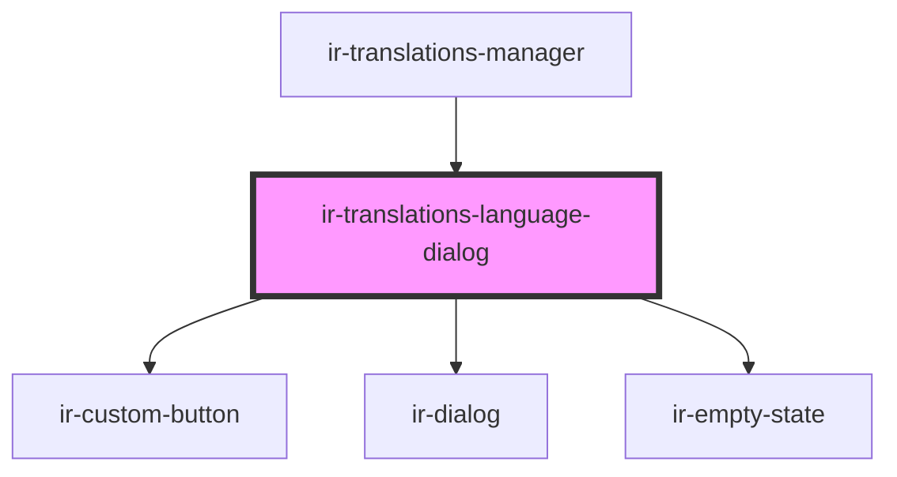

# ir-translations-language-dialog

<!-- Auto Generated Below -->

## Properties

| Property    | Attribute | Description                                                                                                             | Type                    | Default |
| ----------- | --------- | ----------------------------------------------------------------------------------------------------------------------- | ----------------------- | ------- |
| `catalog`   | --        | Every language this property exposes and Setup can persist — the picker offers whichever of these aren't already shown. | `TranslationLanguage[]` | `[]`    |
| `entries`   | --        | Every entry across every table, used to report per-language coverage.                                                   | `TranslationEntry[]`    | `[]`    |
| `languages` | --        |                                                                                                                         | `TranslationLanguage[]` | `[]`    |
| `open`      | `open`    |                                                                                                                         | `boolean`               | `false` |

## Events

| Event               | Description                                                                                                         | Type                               |
| ------------------- | ------------------------------------------------------------------------------------------------------------------- | ---------------------------------- |
| `addLanguage`       |                                                                                                                     | `CustomEvent<TranslationLanguage>` |
| `closeDialog`       |                                                                                                                     | `CustomEvent<void>`                |
| `removeLanguage`    | Hides a language from this manager's view. Every CODE_VALUE_* column always exists in Setup, so nothing is deleted. | `CustomEvent<string>`              |
| `setSourceLanguage` |                                                                                                                     | `CustomEvent<string>`              |

## Dependencies

### Used by

 - [ir-translations-manager](..)

### Depends on

- [ir-custom-button](../../ui/ir-custom-button)
- [ir-dialog](../../ui/ir-dialog)
- [ir-empty-state](../../ir-empty-state)

### Graph

----------------------------------------------

*Built with [StencilJS](https://stenciljs.com/)*
