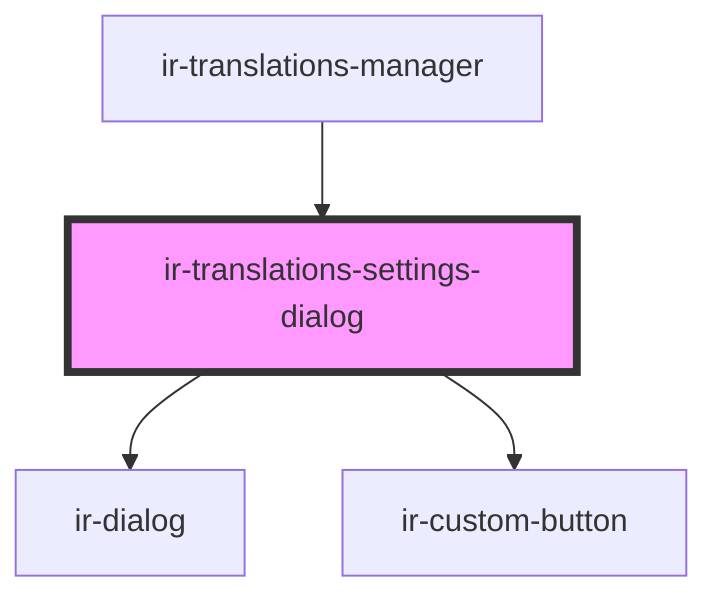

# ir-translations-settings-dialog

<!-- Auto Generated Below -->

## Overview

Settings for the entries grid — which tables the pickers offer, which
non-source languages show up as columns, and whether the notes column is
shown. Every control here edits a local draft only; nothing reaches the
parent (and nothing is persisted) until Save is clicked. Cancel — or
dismissing the dialog any other way — drops the draft entirely.

## Properties

| Property         | Attribute          | Description                                                                                  | Type                    | Default     |
| ---------------- | ------------------ | -------------------------------------------------------------------------------------------- | ----------------------- | ----------- |
| `languages`      | --                 | Every language this property exposes; the pin list only ever applies to the non-source ones. | `TranslationLanguage[]` | `[]`        |
| `open`           | `open`             |                                                                                              | `boolean`               | `false`     |
| `pinnedCodes`    | --                 | Non-source language codes currently shown as columns.                                        | `string[]`              | `[]`        |
| `showNotes`      | `show-notes`       |                                                                                              | `boolean`               | `true`      |
| `sourceCode`     | `source-code`      |                                                                                              | `string`                | `undefined` |
| `usedTablesOnly` | `used-tables-only` | Hides setup tables nothing in this codebase reads — the same filter the table pickers apply. | `boolean`               | `true`      |

## Events

| Event          | Description                              | Type                                     |
| -------------- | ---------------------------------------- | ---------------------------------------- |
| `closeDialog`  |                                          | `CustomEvent<void>`                      |
| `saveSettings` | Emitted once, only when Save is clicked. | `CustomEvent<TranslationsSettingsSaved>` |

## Dependencies

### Used by

 - [ir-translations-manager](..)

### Depends on

- [ir-dialog](../../ui/ir-dialog)
- [ir-custom-button](../../ui/ir-custom-button)

### Graph

----------------------------------------------

*Built with [StencilJS](https://stenciljs.com/)*
