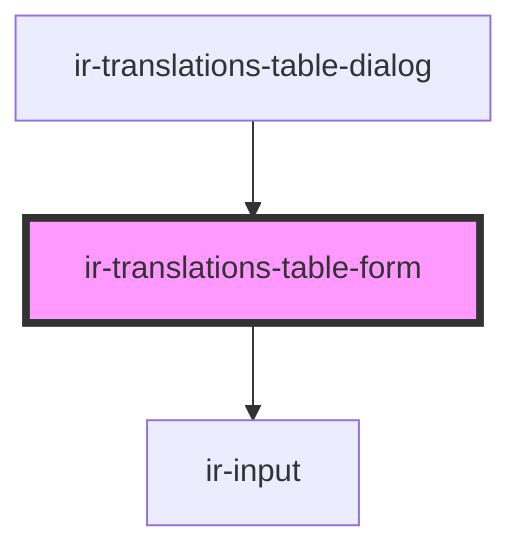

# ir-translations-table-form

<!-- Auto Generated Below -->

## Overview

Owns the table name draft and saves it directly — the dialog around this
form is a dumb open/close shell.

Setup only lists tables that already have at least one row, so creating a
table and renaming an empty one are purely local (no API call); renaming a
non-empty table has to recreate every entry under the new TBL_NAME and
soft-delete the old rows, since there's no bulk-rename endpoint.

## Properties

| Property        | Attribute       | Description                                         | Type                 | Default     |
| --------------- | --------------- | --------------------------------------------------- | -------------------- | ----------- |
| `entryUserId`   | `entry-user-id` |                                                     | `number`             | `undefined` |
| `existingNames` | --              | Names of the other tables, for duplicate detection. | `string[]`           | `[]`        |
| `formId`        | `form-id`       |                                                     | `string`             | `undefined` |
| `mode`          | `mode`          |                                                     | `"create" \| "edit"` | `'create'`  |
| `ownerId`       | `owner-id`      |                                                     | `number`             | `undefined` |
| `table`         | --              |                                                     | `TranslationTable`   | `null`      |

## Events

| Event                  | Description | Type                                                                   |
| ---------------------- | ----------- | ---------------------------------------------------------------------- |
| `isSubmittingChange`   |             | `CustomEvent<boolean>`                                                 |
| `submitDisabledChange` |             | `CustomEvent<boolean>`                                                 |
| `tableSaved`           |             | `CustomEvent<{ id: string; name: string; mode: "edit" \| "create"; }>` |
| `tableSaveFailed`      |             | `CustomEvent<void>`                                                    |

## Dependencies

### Used by

 - [ir-translations-table-dialog](..)

### Depends on

- [ir-input](../../../ui/ir-input)

### Graph

----------------------------------------------

*Built with [StencilJS](https://stenciljs.com/)*
