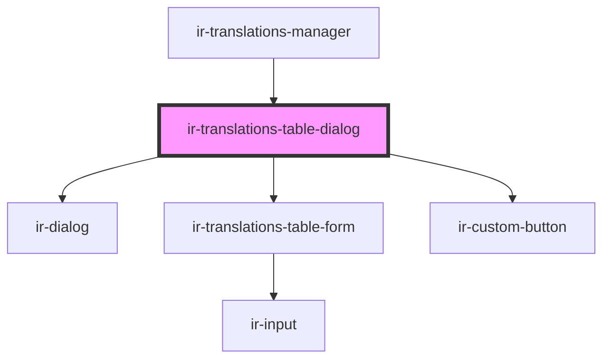

# ir-translations-table-dialog

<!-- Auto Generated Below -->

## Overview

Dumb open/close shell — the nested ir-translations-table-form owns the
draft, validation, and the actual save call.

## Properties

| Property        | Attribute       | Description                                         | Type                 | Default                     |
| --------------- | --------------- | --------------------------------------------------- | -------------------- | --------------------------- |
| `entryUserId`   | `entry-user-id` |                                                     | `number`             | `undefined`                 |
| `existingNames` | --              | Names of the other tables, for duplicate detection. | `string[]`           | `[]`                        |
| `formId`        | `form-id`       |                                                     | `string`             | `'translations-table-form'` |
| `mode`          | `mode`          |                                                     | `"create" \| "edit"` | `'create'`                  |
| `open`          | `open`          |                                                     | `boolean`            | `false`                     |
| `ownerId`       | `owner-id`      |                                                     | `number`             | `undefined`                 |
| `table`         | --              |                                                     | `TranslationTable`   | `null`                      |

## Events

| Event             | Description | Type                                                                   |
| ----------------- | ----------- | ---------------------------------------------------------------------- |
| `closeDialog`     |             | `CustomEvent<void>`                                                    |
| `tableSaved`      |             | `CustomEvent<{ id: string; name: string; mode: "edit" \| "create"; }>` |
| `tableSaveFailed` |             | `CustomEvent<void>`                                                    |

## Dependencies

### Used by

 - [ir-translations-manager](..)

### Depends on

- [ir-dialog](../../ui/ir-dialog)
- [ir-translations-table-form](ir-translations-table-form)
- [ir-custom-button](../../ui/ir-custom-button)

### Graph

----------------------------------------------

*Built with [StencilJS](https://stenciljs.com/)*
