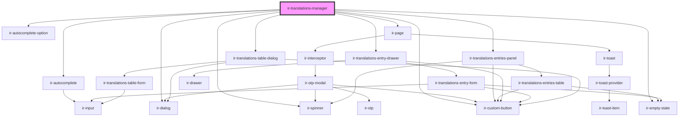

# ir-translations-manager

<!-- Auto Generated Below -->

## Properties

| Property     | Attribute    | Description                                                                       | Type     | Default     |
| ------------ | ------------ | --------------------------------------------------------------------------------- | -------- | ----------- |
| `propertyid` | `propertyid` | Owning property id, sent as OWNER_ID on every write.                              | `number` | `undefined` |
| `ticket`     | `ticket`     | Auth ticket for the Setup API, following the same pattern as other feature roots. | `string` | `undefined` |
| `userId`     | `user-id`    | Acting user id, sent as ENTRY_USER_ID on every write.                             | `number` | `undefined` |

## Dependencies

### Depends on

- [ir-autocomplete](../ui/ir-autocomplete)
- [ir-autocomplete-option](../ui/ir-autocomplete/ir-autocomplete-option)
- [ir-page](../ui/ir-page)
- [ir-spinner](../ui/ir-spinner)
- [ir-empty-state](../ir-empty-state)
- [ir-custom-button](../ui/ir-custom-button)
- [ir-translations-entries-panel](ir-translations-entries-panel)
- [ir-translations-entry-drawer](ir-translations-entry-drawer)
- [ir-translations-table-dialog](ir-translations-table-dialog)
- [ir-dialog](../ui/ir-dialog)

### Graph

----------------------------------------------

*Built with [StencilJS](https://stenciljs.com/)*
