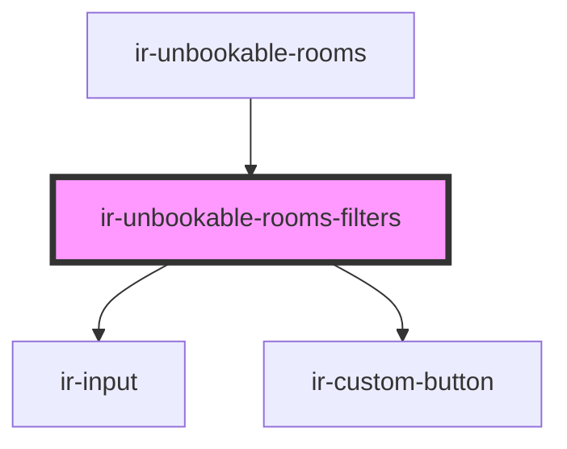

# ir-unbookable-rooms-filters

<!-- Auto Generated Below -->

## Properties

| Property          | Attribute    | Description | Type                                                                                                                                                                                                                                                                    | Default                                                          |
| ----------------- | ------------ | ----------- | ----------------------------------------------------------------------------------------------------------------------------------------------------------------------------------------------------------------------------------------------------------------------- | ---------------------------------------------------------------- |
| `filters`         | --           |             | `{ period_to_check: number; consecutive_period: number; country: string; }`                                                                                                                                                                                             | `{ period_to_check: 2, consecutive_period: 14, country: 'all' }` |
| `isLoading`       | `is-loading` |             | `boolean`                                                                                                                                                                                                                                                               | `false`                                                          |
| `mode`            | `mode`       |             | `"default" \| "mpo"`                                                                                                                                                                                                                                                    | `'default'`                                                      |
| `unbookableRooms` | --           |             | `{ first_night_not_bookable: string; property_id: number; room_type_id: number; room_type_name: string; country: { cities: null; code: null; currency: null; flag: null; gmt_offset: number; id: number; market_places: null; name: string; phone_prefix: null; }; }[]` | `[]`                                                             |

## Events

| Event           | Description | Type                                                                                        |
| --------------- | ----------- | ------------------------------------------------------------------------------------------- |
| `filtersChange` |             | `CustomEvent<{ period_to_check?: number; consecutive_period?: number; country?: string; }>` |
| `filtersReset`  |             | `CustomEvent<void>`                                                                         |
| `filtersSave`   |             | `CustomEvent<void>`                                                                         |

## Dependencies

### Used by

 - [ir-unbookable-rooms](..)

### Depends on

- [ir-input](../../ui/ir-input)
- [ir-custom-button](../../ui/ir-custom-button)

### Graph

----------------------------------------------

*Built with [StencilJS](https://stenciljs.com/)*
