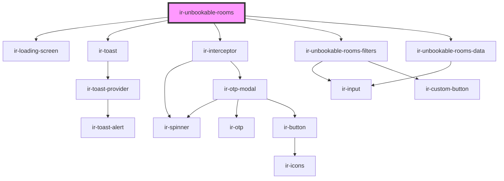

# ir-unbookable-rooms

<!-- Auto Generated Below -->

## Properties

| Property             | Attribute            | Description | Type                 | Default     |
| -------------------- | -------------------- | ----------- | -------------------- | ----------- |
| `consecutive_period` | `consecutive_period` |             | `number`             | `14`        |
| `mode`               | `mode`               |             | `"default" \| "mpo"` | `'default'` |
| `period_to_check`    | `period_to_check`    |             | `number`             | `2`         |
| `propertyid`         | `propertyid`         |             | `number`             | `undefined` |
| `ticket`             | `ticket`             |             | `string`             | `''`        |

## Dependencies

### Depends on

- [ir-loading-screen](../ir-loading-screen)
- [ir-toast](../ui/ir-toast)
- [ir-interceptor](../ir-interceptor)
- [ir-unbookable-rooms-filters](ir-unbookable-rooms-filters)
- [ir-unbookable-rooms-data](ir-unbookable-rooms-data)

### Graph

----------------------------------------------

*Built with [StencilJS](https://stenciljs.com/)*
