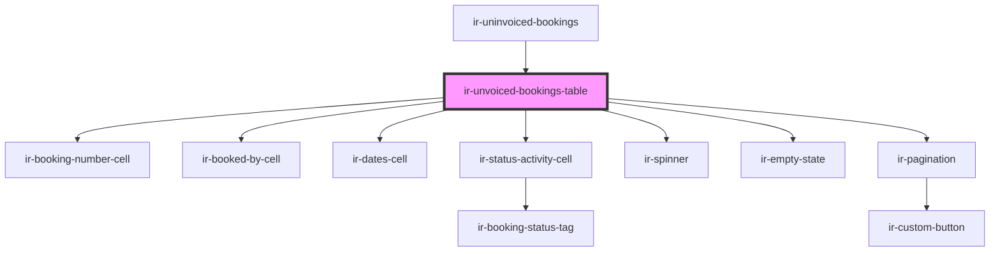

# ir-unvoiced-bookings-table

<!-- Auto Generated Below -->

## Events

| Event                          | Description | Type                |
| ------------------------------ | ----------- | ------------------- |
| `uninvoicedBookingsPageChange` |             | `CustomEvent<void>` |

## Dependencies

### Used by

 - [ir-uninvoiced-bookings](..)

### Depends on

- [ir-booking-number-cell](../../table-cells/booking/ir-booking-number-cell)
- [ir-booked-by-cell](../../table-cells/booking/ir-booked-by-cell)
- [ir-dates-cell](../../table-cells/booking/ir-dates-cell)
- [ir-status-activity-cell](../../table-cells/booking/ir-status-activity-cell)
- [ir-spinner](../../ui/ir-spinner)
- [ir-empty-state](../../ir-empty-state)
- [ir-pagination](../../ir-pagination)

### Graph

----------------------------------------------

*Built with [StencilJS](https://stenciljs.com/)*
