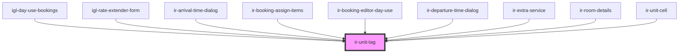

# ir-unit-tag

<!-- Auto Generated Below -->

## Properties

| Property | Attribute | Description | Type     | Default     |
| -------- | --------- | ----------- | -------- | ----------- |
| `unit`   | `unit`    |             | `string` | `undefined` |

## Dependencies

### Used by

 - [igl-day-use-bookings](../igloo-calendar/igl-day-use-bookings)
 - [igl-rate-extender-form](../igloo-calendar/igl-rate-extender-drawer/igl-rate-extender-form)
 - [ir-arrival-time-dialog](../ir-booking-details/ir-arrival-time-dialog/ir-arrival-time-dialog)
 - [ir-booking-assign-items](../ir-booking-details/ir-booking-source-editor-dialog/ir-booking-assign-items)
 - [ir-booking-editor-day-use](../igloo-calendar/ir-booking-editor/ir-booking-editor-day-use)
 - [ir-departure-time-dialog](../ir-booking-details/ir-room/ir-departure-time-dialog)
 - [ir-extra-service](../ir-booking-details/ir-extra-services/ir-extra-service)
 - [ir-room-details](../ir-booking-details/ir-room/ir-room-details)
 - [ir-unit-cell](../table-cells/booking/ir-unit-cell)

### Graph

```mermaid
graph TD;
  igl-day-use-bookings --> ir-unit-tag
  igl-rate-extender-form --> ir-unit-tag
  ir-arrival-time-dialog --> ir-unit-tag
  ir-booking-assign-items --> ir-unit-tag
  ir-booking-editor-day-use --> ir-unit-tag
  ir-departure-time-dialog --> ir-unit-tag
  ir-extra-service --> ir-unit-tag
  ir-room-details --> ir-unit-tag
  ir-unit-cell --> ir-unit-tag
  style ir-unit-tag fill:#f9f,stroke:#333,stroke-width:4px
```

----------------------------------------------

*Built with [StencilJS](https://stenciljs.com/)*
