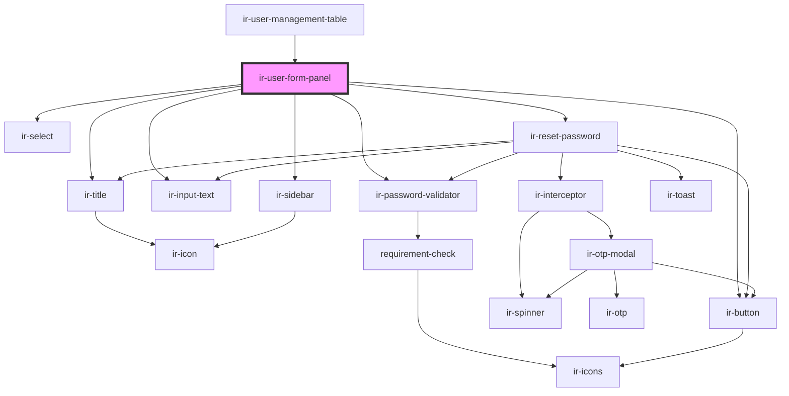

# ir-user-form-panel

<!-- Auto Generated Below -->

## Properties

| Property              | Attribute               | Description | Type                                                                                                                                                                                                                                                                                | Default                         |
| --------------------- | ----------------------- | ----------- | ----------------------------------------------------------------------------------------------------------------------------------------------------------------------------------------------------------------------------------------------------------------------------------- | ------------------------------- |
| `allowedUsersTypes`   | --                      |             | `AllowedUser[]`                                                                                                                                                                                                                                                                     | `[]`                            |
| `baseUserTypeCode`    | `base-user-type-code`   |             | `number \| string`                                                                                                                                                                                                                                                                  | `undefined`                     |
| `haveAdminPrivileges` | `have-admin-privileges` |             | `boolean`                                                                                                                                                                                                                                                                           | `undefined`                     |
| `isEdit`              | `is-edit`               |             | `boolean`                                                                                                                                                                                                                                                                           | `false`                         |
| `language`            | `language`              |             | `string`                                                                                                                                                                                                                                                                            | `'en'`                          |
| `property_id`         | `property_id`           |             | `number`                                                                                                                                                                                                                                                                            | `undefined`                     |
| `superAdminId`        | `super-admin-id`        |             | `string`                                                                                                                                                                                                                                                                            | `'5'`                           |
| `user`                | --                      |             | `THKUser & { type: string; is_active: boolean; sign_ins: SignIn[]; is_email_verified?: boolean; created_on: string; password: string; email: string; role?: string; }`                                                                                                              | `undefined`                     |
| `userTypeCode`        | `user-type-code`        |             | `number \| string`                                                                                                                                                                                                                                                                  | `undefined`                     |
| `userTypes`           | --                      |             | `{ new (entries?: readonly (readonly [string \| number, string])[]): Map<string \| number, string>; new (iterable?: Iterable<readonly [string \| number, string]>): Map<string \| number, string>; readonly prototype: Map<any, any>; readonly [Symbol.species]: MapConstructor; }` | `Map<number \| string, string>` |

## Events

| Event          | Description | Type                |
| -------------- | ----------- | ------------------- |
| `closeSideBar` |             | `CustomEvent<null>` |
| `resetData`    |             | `CustomEvent<null>` |

## Dependencies

### Used by

 - [ir-user-management-table](../ir-user-management-table)

### Depends on

- [ir-title](../../ir-title)
- [ir-input-text](../../ui/ir-input-text)
- [ir-select](../../ui/ir-select)
- [ir-password-validator](../../ir-password-validator)
- [ir-button](../../ui/ir-button)
- [ir-sidebar](../../ui/ir-sidebar)
- [ir-reset-password](../../ir-reset-password)

### Graph

----------------------------------------------

*Built with [StencilJS](https://stenciljs.com/)*
