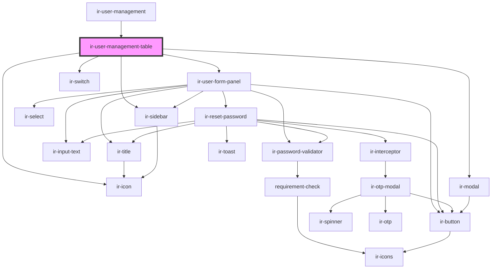

# ir-user-management-table

<!-- Auto Generated Below -->

## Properties

| Property              | Attribute               | Description | Type                            | Default     |
| --------------------- | ----------------------- | ----------- | ------------------------------- | ----------- |
| `allowedUsersTypes`   | --                      |             | `AllowedUser[]`                 | `[]`        |
| `baseUserTypeCode`    | `base-user-type-code`   |             | `number \| string`              | `undefined` |
| `haveAdminPrivileges` | `have-admin-privileges` |             | `boolean`                       | `undefined` |
| `isSuperAdmin`        | `is-super-admin`        |             | `boolean`                       | `undefined` |
| `property_id`         | `property_id`           |             | `number`                        | `undefined` |
| `superAdminId`        | `super-admin-id`        |             | `string`                        | `'5'`       |
| `userTypeCode`        | `user-type-code`        |             | `number \| string`              | `undefined` |
| `userTypes`           | --                      |             | `Map<string \| number, string>` | `new Map()` |
| `users`               | --                      |             | `User[]`                        | `[]`        |

## Events

| Event       | Description | Type                                                                                                 |
| ----------- | ----------- | ---------------------------------------------------------------------------------------------------- |
| `resetData` |             | `CustomEvent<null>`                                                                                  |
| `toast`     |             | `CustomEvent<ICustomToast & Partial<IToastWithButton> \| IDefaultToast & Partial<IToastWithButton>>` |

## Dependencies

### Used by

 - [ir-user-management](..)

### Depends on

- [ir-user-form-panel](../ir-user-form-panel)
- [ir-icon](../../ui/ir-icon)
- [ir-switch](../../ui/ir-switch)
- [ir-sidebar](../../ui/ir-sidebar)
- [ir-modal](../../ui/ir-modal)

### Graph

----------------------------------------------

*Built with [StencilJS](https://stenciljs.com/)*
