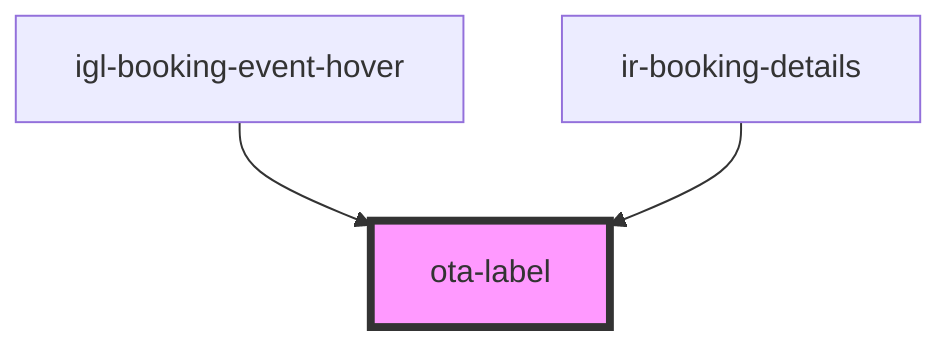

# ota-label

<!-- Auto Generated Below -->

## Properties

| Property          | Attribute           | Description | Type          | Default     |
| ----------------- | ------------------- | ----------- | ------------- | ----------- |
| `label`           | `label`             |             | `string`      | `undefined` |
| `maxVisibleItems` | `max-visible-items` |             | `number`      | `3`         |
| `remarks`         | --                  |             | `IOtaNotes[]` | `undefined` |

## Dependencies

### Used by

 - [igl-booking-event-hover](../igloo-calendar/igl-booking-event-hover)
 - [ir-booking-details](../ir-booking-details)

### Graph

----------------------------------------------

*Built with [StencilJS](https://stenciljs.com/)*
