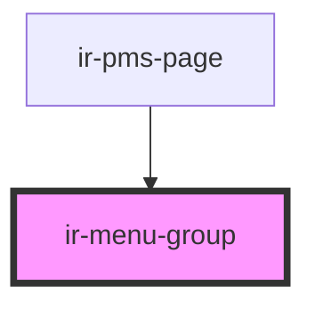

# ir-menu-group

<!-- Auto Generated Below -->

## Properties

| Property    | Attribute    | Description | Type      | Default     |
| ----------- | ------------ | ----------- | --------- | ----------- |
| `groupName` | `group-name` |             | `string`  | `undefined` |
| `open`      | `open`       |             | `boolean` | `undefined` |

## Events

| Event         | Description | Type                   |
| ------------- | ----------- | ---------------------- |
| `openChanged` |             | `CustomEvent<boolean>` |

## Dependencies

### Used by

 - [ir-pms-page](../ir-pms-page)

### Graph

----------------------------------------------

*Built with [StencilJS](https://stenciljs.com/)*
