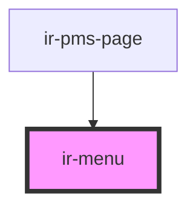

# ir-menu

<!-- Auto Generated Below -->

## Properties

| Property       | Attribute       | Description | Type     | Default     |
| -------------- | --------------- | ----------- | -------- | ----------- |
| `selectedHref` | `selected-href` |             | `string` | `undefined` |

## Methods

### `setSelectedHref(href?: string) => Promise<void>`

#### Parameters

| Name   | Type     | Description |
| ------ | -------- | ----------- |
| `href` | `string` |             |

#### Returns

Type: `Promise<void>`

## Dependencies

### Used by

 - [ir-pms-page](../ir-pms-page)

### Graph

----------------------------------------------

*Built with [StencilJS](https://stenciljs.com/)*
