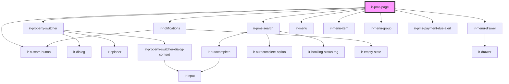

# ir-pms-page

<!-- Auto Generated Below -->

## Properties

| Property     | Attribute    | Description | Type     | Default     |
| ------------ | ------------ | ----------- | -------- | ----------- |
| `propertyid` | `propertyid` |             | `string` | `undefined` |
| `ticket`     | `ticket`     |             | `string` | `undefined` |

## Dependencies

### Depends on

- [ir-custom-button](../../ui/ir-custom-button)
- [ir-property-switcher](../ir-property-switcher)
- [ir-pms-search](../ir-pms-search)
- [ir-notifications](../../ir-notifications)
- [ir-menu-drawer](../ir-menu-drawer)
- [ir-menu](../ir-menu)
- [ir-menu-item](../ir-menu-item)
- [ir-menu-group](../ir-menu-group)
- [ir-pms-payment-due-alert](../ir-pms-payment-due-alert)

### Graph

----------------------------------------------

*Built with [StencilJS](https://stenciljs.com/)*
