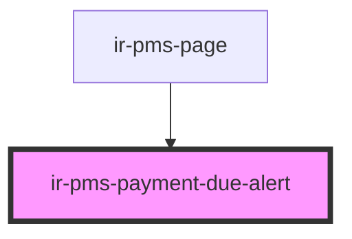

# ir-pms-payment-due-alert

<!-- Auto Generated Below -->

## Properties

| Property     | Attribute    | Description | Type     | Default     |
| ------------ | ------------ | ----------- | -------- | ----------- |
| `baseUrl`    | `base-url`   |             | `string` | `undefined` |
| `propertyid` | `propertyid` |             | `number` | `undefined` |
| `ticket`     | `ticket`     |             | `string` | `undefined` |

## Dependencies

### Used by

 - [ir-pms-page](../ir-pms-page)

### Graph

----------------------------------------------

*Built with [StencilJS](https://stenciljs.com/)*
