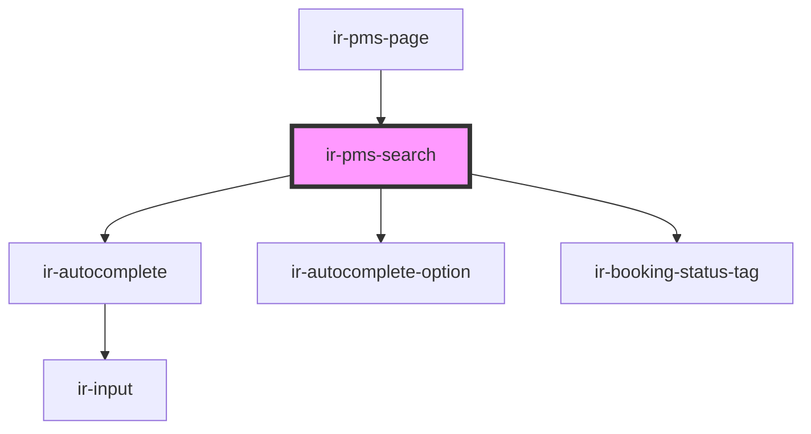

# ir-pms-search

<!-- Auto Generated Below -->

## Properties

| Property     | Attribute    | Description | Type     | Default     |
| ------------ | ------------ | ----------- | -------- | ----------- |
| `propertyid` | `propertyid` |             | `string` | `undefined` |
| `ticket`     | `ticket`     |             | `string` | `undefined` |

## Events

| Event             | Description | Type                                       |
| ----------------- | ----------- | ------------------------------------------ |
| `combobox-select` |             | `CustomEvent<IrComboboxSelectEventDetail>` |

## Dependencies

### Used by

 - [ir-pms-page](../ir-pms-page)

### Depends on

- [ir-autocomplete](../../ui/ir-autocomplete)
- [ir-autocomplete-option](../../ui/ir-autocomplete/ir-autocomplete-option)
- [ir-booking-status-tag](../../ui/ir-booking-status-tag)

### Graph

----------------------------------------------

*Built with [StencilJS](https://stenciljs.com/)*
