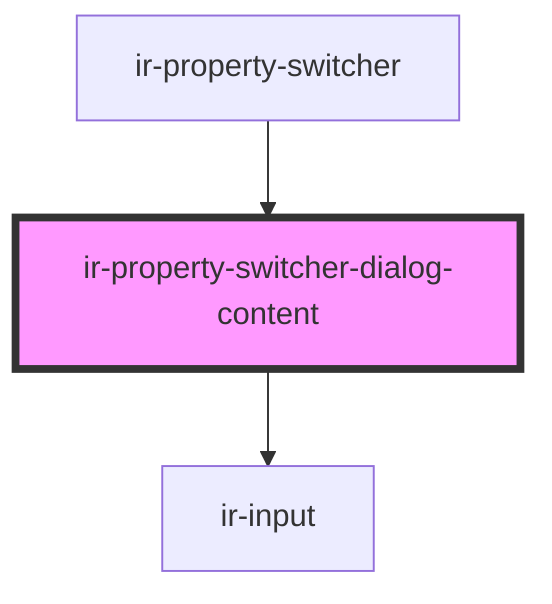

# ir-property-switcher

Button-triggered dialog that loads allowed properties from `/Get_Exposed_Allowed_Properties`, lets the user filter them via a search input, and outputs the chosen property as a `propertyChange` event. The dialog content lives in `ir-property-switcher-dialog-content`, which is responsible for fetching data, filtering, and keeping the highlighted `wa-option` in sync with keyboard navigation.

## Events

| Event            | Description                                  |
| ---------------- | -------------------------------------------- |
| `propertyChange` | Fires when the user selects a property entry |

<!-- Auto Generated Below -->

## Overview

Internal component responsible for rendering the searchable list of properties inside the switcher dialog.
It owns the data fetching, filtering and keyboard navigation logic so the parent dialog stays lean.

## Properties

| Property             | Attribute              | Description                                                                                 | Type      | Default     |
| -------------------- | ---------------------- | ------------------------------------------------------------------------------------------- | --------- | ----------- |
| `open`               | `open`                 | Whether the surrounding dialog is open. Used to focus and reset the search input as needed. | `boolean` | `false`     |
| `selectedPropertyId` | `selected-property-id` | ID of the property that is currently selected in the parent component.                      | `number`  | `undefined` |

## Events

| Event              | Description                                             | Type                                           |
| ------------------ | ------------------------------------------------------- | ---------------------------------------------- |
| `propertySelected` | Emits whenever the user picks a property from the list. | `CustomEvent<{ name?: string; id?: number; }>` |

## Dependencies

### Used by

 - [ir-property-switcher](.)

### Depends on

- [ir-input](../../ui/ir-input)

### Graph

----------------------------------------------

*Built with [StencilJS](https://stenciljs.com/)*
