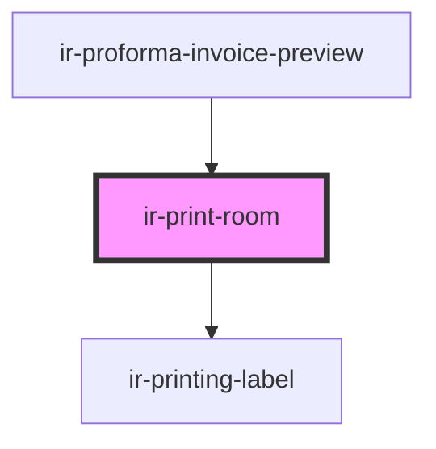

# ir-print-room

<!-- Auto Generated Below -->

## Properties

| Property   | Attribute  | Description                   | Type       | Default     |
| ---------- | ---------- | ----------------------------- | ---------- | ----------- |
| `booking`  | --         | Booking context               | `Booking`  | `undefined` |
| `currency` | `currency` | Currency code (e.g. USD, EUR) | `string`   | `undefined` |
| `idx`      | `idx`      | Room index                    | `number`   | `undefined` |
| `property` | --         | Property context              | `Property` | `undefined` |
| `room`     | --         | Room data                     | `Room`     | `undefined` |

## Dependencies

### Used by

 - [ir-proforma-invoice-preview](../ir-proforma-invoice-preview)

### Depends on

- [ir-printing-label](../ir-printing-label)

### Graph

----------------------------------------------

*Built with [StencilJS](https://stenciljs.com/)*
