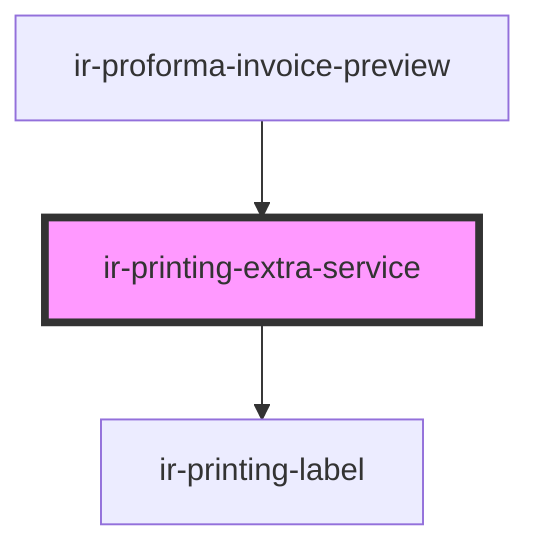

# ir-printing-extra-service

<!-- Auto Generated Below -->

## Properties

| Property        | Attribute | Description                            | Type                                                                                                                                                                       | Default     |
| --------------- | --------- | -------------------------------------- | -------------------------------------------------------------------------------------------------------------------------------------------------------------------------- | ----------- |
| `currency`      | --        | Booking currency                       | `Currency`                                                                                                                                                                 | `undefined` |
| `extraServices` | --        | Extra services attached to the booking | `{ system_id?: number; cost?: number; description?: string; booking_system_id?: number; currency_id?: number; end_date?: string; start_date?: string; price?: number; }[]` | `undefined` |
| `invocableKeys` | --        |                                        | `Set<string \| number>`                                                                                                                                                    | `undefined` |

## Dependencies

### Used by

 - [ir-proforma-invoice-preview](../ir-proforma-invoice-preview)

### Depends on

- [ir-printing-label](../ir-printing-label)

### Graph

----------------------------------------------

*Built with [StencilJS](https://stenciljs.com/)*
