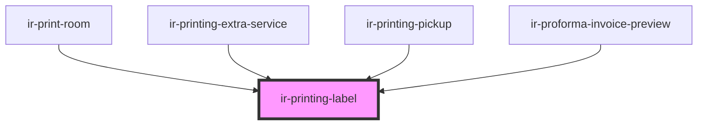

# ir-printing-label

<!-- Auto Generated Below -->

## Properties

| Property  | Attribute | Description                                                 | Type                 | Default     |
| --------- | --------- | ----------------------------------------------------------- | -------------------- | ----------- |
| `asHtml`  | `as-html` |                                                             | `boolean`            | `undefined` |
| `content` | `content` | Fallback content text (used if no content slot is provided) | `string`             | `undefined` |
| `display` | `display` |                                                             | `"flex" \| "inline"` | `'flex'`    |
| `label`   | `label`   | Fallback label text (used if no label slot is provided)     | `string`             | `undefined` |

## Shadow Parts

| Part          | Description |
| ------------- | ----------- |
| `"container"` |             |
| `"content"`   |             |
| `"label"`     |             |

## Dependencies

### Used by

 - [ir-print-room](../ir-print-room)
 - [ir-printing-extra-service](../ir-printing-extra-service)
 - [ir-printing-pickup](../ir-printing-pickup)
 - [ir-proforma-invoice-preview](../ir-proforma-invoice-preview)

### Graph

----------------------------------------------

*Built with [StencilJS](https://stenciljs.com/)*
