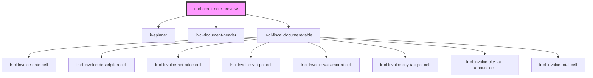

# ir-cl-credit-note-preview

<!-- Auto Generated Below -->

## Properties

| Property         | Attribute         | Description | Type     | Default     |
| ---------------- | ----------------- | ----------- | -------- | ----------- |
| `agentId`        | `agent-id`        |             | `number` | `undefined` |
| `agentName`      | `agent-name`      |             | `string` | `undefined` |
| `baseurl`        | `baseurl`         |             | `string` | `undefined` |
| `documentNumber` | `document-number` |             | `string` | `undefined` |
| `externalRef`    | `external-ref`    |             | `string` | `undefined` |
| `propertyId`     | `property-id`     |             | `number` | `undefined` |
| `ticket`         | `ticket`          |             | `string` | `undefined` |

## Events

| Event            | Description | Type                |
| ---------------- | ----------- | ------------------- |
| `clPreviewReady` |             | `CustomEvent<void>` |

## Dependencies

### Depends on

- [ir-spinner](../../../../ui/ir-spinner)
- [ir-cl-document-header](../ir-cl-document-header)
- [ir-cl-fiscal-document-table](../ir-cl-fiscal-document-table)

### Graph

----------------------------------------------

*Built with [StencilJS](https://stenciljs.com/)*
