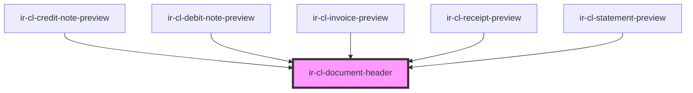

# ir-cl-document-header

<!-- Auto Generated Below -->

## Properties

| Property         | Attribute         | Description                                                   | Type                                                                   | Default     |
| ---------------- | ----------------- | ------------------------------------------------------------- | ---------------------------------------------------------------------- | ----------- |
| `agentName`      | `agent-name`      | Name of the agent/company to bill to.                         | `string`                                                               | `undefined` |
| `documentNumber` | `document-number` | Optional document reference number shown in the meta block.   | `string`                                                               | `undefined` |
| `documentType`   | `document-type`   |                                                               | `"creditnote" \| "debitnote" \| "invoice" \| "receipt" \| "statement"` | `'invoice'` |
| `property`       | --                | Property whose branding and details appear on the right side. | `IProperty`                                                            | `undefined` |

## Dependencies

### Used by

 - [ir-cl-credit-note-preview](../ir-cl-credit-note-preview)
 - [ir-cl-debit-note-preview](../ir-cl-debit-note-preview)
 - [ir-cl-invoice-preview](../ir-cl-invoice-preview)
 - [ir-cl-receipt-preview](../ir-cl-receipt-preview)
 - [ir-cl-statement-preview](../ir-cl-statement-preview)

### Graph

----------------------------------------------

*Built with [StencilJS](https://stenciljs.com/)*
