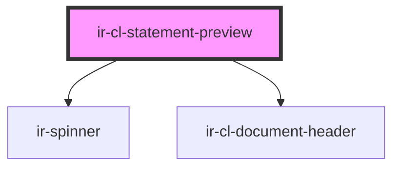

# ir-cl-statement-preview

<!-- Auto Generated Below -->

## Properties

| Property     | Attribute     | Description | Type     | Default     |
| ------------ | ------------- | ----------- | -------- | ----------- |
| `agentId`    | `agent-id`    |             | `number` | `undefined` |
| `agentName`  | `agent-name`  |             | `string` | `undefined` |
| `baseurl`    | `baseurl`     |             | `string` | `undefined` |
| `currencyId` | `currency-id` |             | `number` | `undefined` |
| `fromDate`   | `from-date`   |             | `string` | `undefined` |
| `propertyId` | `property-id` |             | `number` | `undefined` |
| `ticket`     | `ticket`      |             | `string` | `undefined` |
| `toDate`     | `to-date`     |             | `string` | `undefined` |

## Events

| Event            | Description | Type                |
| ---------------- | ----------- | ------------------- |
| `clPreviewReady` |             | `CustomEvent<void>` |

## Dependencies

### Depends on

- [ir-spinner](../../../../ui/ir-spinner)
- [ir-cl-document-header](../ir-cl-document-header)

### Graph

----------------------------------------------

*Built with [StencilJS](https://stenciljs.com/)*
