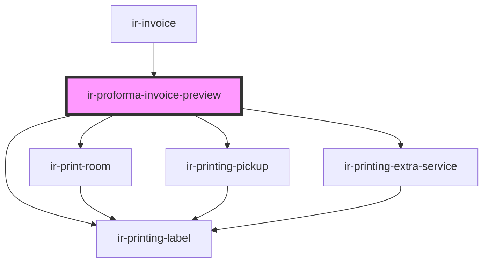

# ir-proforma-invoice-preview

<!-- Auto Generated Below -->

## Properties

| Property      | Attribute     | Description                                                                                                          | Type                                                                                                                                                                                                                                                                                                                                                                                                                                                                                                                                                                                                                                                                                                                                                                                                                                                                                                                                                                                                                                                             | Default     |
| ------------- | ------------- | -------------------------------------------------------------------------------------------------------------------- | ---------------------------------------------------------------------------------------------------------------------------------------------------------------------------------------------------------------------------------------------------------------------------------------------------------------------------------------------------------------------------------------------------------------------------------------------------------------------------------------------------------------------------------------------------------------------------------------------------------------------------------------------------------------------------------------------------------------------------------------------------------------------------------------------------------------------------------------------------------------------------------------------------------------------------------------------------------------------------------------------------------------------------------------------------------------- | ----------- |
| `booking`     | --            | Booking context used to display property, guest, and folio details.                                                  | `Booking`                                                                                                                                                                                                                                                                                                                                                                                                                                                                                                                                                                                                                                                                                                                                                                                                                                                                                                                                                                                                                                                        | `undefined` |
| `footerNote`  | `footer-note` | Optional footer text shown at the end of the preview.                                                                | `string`                                                                                                                                                                                                                                                                                                                                                                                                                                                                                                                                                                                                                                                                                                                                                                                                                                                                                                                                                                                                                                                         | `undefined` |
| `invoice`     | --            | Invoice payload emitted by `ir-invoice-form`. Totals will fall back to booking data when omitted.                    | `{ currency?: { id?: number; }; booking_nbr?: string; target?: { code?: string; description?: string; }; Date?: string; nbr?: string; remark?: string; billed_to_name?: string; billed_to_tax?: string; items?: { key?: string \| number; type?: string; description?: string; amount?: number; }[]; }`                                                                                                                                                                                                                                                                                                                                                                                                                                                                                                                                                                                                                                                                                                                                                          | `undefined` |
| `invoiceInfo` | --            | Optional metadata fetched via `getBookingInvoiceInfo`. Used to display reference numbers (invoice/credit note/etc.). | `{ invoiceable_items?: { key?: number; type?: InvoiceableItemType; status?: any; system_id?: any; amount?: number; currency?: { symbol?: string; code?: string; id?: number; }; booking_nbr?: string; invoice_nbr?: string; reason?: { code?: InvoiceableItemReasonCode; description?: string; }; is_invoiceable?: boolean; }[]; invoices?: { user?: string; status?: { code?: string; description?: any; }; date?: string; system_id?: number; currency?: { symbol?: string; code?: string; id?: number; }; booking_nbr?: string; total_amount?: any; target?: any; nbr?: string; remark?: string; billed_to_name?: any; billed_to_tax?: any; items?: { key?: number; type?: string; status?: { code?: string; description?: any; }; description?: any; system_id?: number; amount?: number; currency?: { symbol?: string; code?: string; id?: number; }; booking_nbr?: string; invoice_nbr?: string; is_invoiceable?: boolean; }[]; credit_note?: { user?: string; date?: string; system_id?: string; reason?: string; nbr?: string; }; pdf_url?: any; }[]; }` | `undefined` |
| `locale`      | `locale`      | Locale used for date formatting.                                                                                     | `string`                                                                                                                                                                                                                                                                                                                                                                                                                                                                                                                                                                                                                                                                                                                                                                                                                                                                                                                                                                                                                                                         | `'en'`      |
| `property`    | --            | Property associated with the booking.                                                                                | `Property`                                                                                                                                                                                                                                                                                                                                                                                                                                                                                                                                                                                                                                                                                                                                                                                                                                                                                                                                                                                                                                                       | `undefined` |

## Dependencies

### Used by

 - [ir-invoice](../../../ir-invoice)

### Depends on

- [ir-printing-label](../../ir-printing-label)
- [ir-print-room](../../ir-print-room)
- [ir-printing-pickup](../../ir-printing-pickup)
- [ir-printing-extra-service](../../ir-printing-extra-service)

### Graph

----------------------------------------------

*Built with [StencilJS](https://stenciljs.com/)*
