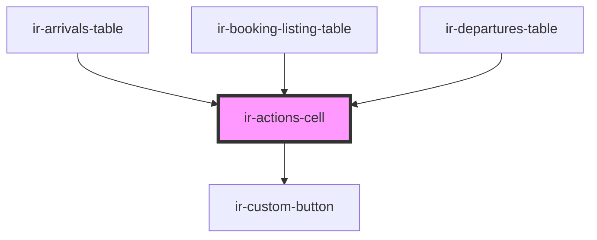

# ir-actions-cell

<!-- Auto Generated Below -->

## Properties

| Property  | Attribute | Description | Type               | Default |
| --------- | --------- | ----------- | ------------------ | ------- |
| `buttons` | --        |             | `IrActionButton[]` | `[]`    |

## Events

| Event      | Description | Type                                       |
| ---------- | ----------- | ------------------------------------------ |
| `irAction` |             | `CustomEvent<{ action: IrActionButton; }>` |

## Dependencies

### Used by

 - [ir-arrivals-table](../../../ir-arrivals/ir-arrivals-table)
 - [ir-booking-listing-table](../../../ir-booking-listing/ir-booking-listing-table)
 - [ir-departures-table](../../../ir-departures/ir-departures-table)

### Depends on

- [ir-custom-button](../../../ui/ir-custom-button)

### Graph

----------------------------------------------

*Built with [StencilJS](https://stenciljs.com/)*
