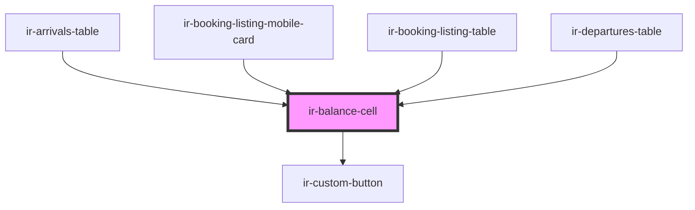

# ir-balance-cell

<!-- Auto Generated Below -->

## Properties

| Property                      | Attribute         | Description | Type                  | Default     |
| ----------------------------- | ----------------- | ----------- | --------------------- | ----------- |
| `bookingNumber` _(required)_  | `booking-number`  |             | `string`              | `undefined` |
| `currencySymbol` _(required)_ | `currency-symbol` |             | `string`              | `undefined` |
| `display`                     | `display`         |             | `"block" \| "inline"` | `'block'`   |
| `financial` _(required)_      | --                |             | `IFinancial`          | `undefined` |
| `isDirect` _(required)_       | `is-direct`       |             | `boolean`             | `undefined` |
| `label`                       | `label`           |             | `string`              | `undefined` |
| `removeBalance`               | `remove-balance`  |             | `boolean`             | `undefined` |
| `statusCode` _(required)_     | `status-code`     |             | `string`              | `undefined` |

## Events

| Event               | Description | Type                                                      |
| ------------------- | ----------- | --------------------------------------------------------- |
| `payBookingBalance` |             | `CustomEvent<{ booking_nbr: string; payment: Payment; }>` |

## Dependencies

### Used by

 - [ir-arrivals-table](../../../ir-arrivals/ir-arrivals-table)
 - [ir-booking-listing-mobile-card](../../../ir-booking-listing/ir-booking-listing-mobile-card)
 - [ir-booking-listing-table](../../../ir-booking-listing/ir-booking-listing-table)
 - [ir-departures-table](../../../ir-departures/ir-departures-table)

### Depends on

- [ir-custom-button](../../../ui/ir-custom-button)

### Graph

----------------------------------------------

*Built with [StencilJS](https://stenciljs.com/)*
