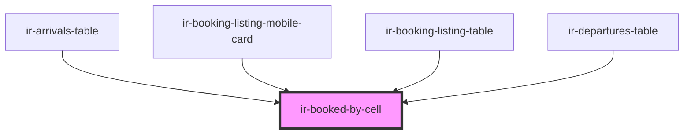

# ir-booked-by-source-cell

<!-- Auto Generated Below -->

## Properties

| Property               | Attribute                 | Description                                                            | Type                  | Default     |
| ---------------------- | ------------------------- | ---------------------------------------------------------------------- | --------------------- | ----------- |
| `cellId`               | `cell-id`                 |                                                                        | `string`              | `undefined` |
| `clickableGuest`       | `clickable-guest`         | Makes the guest name clickable. Emits `openGuestDetails` when clicked. | `boolean`             | `false`     |
| `display`              | `display`                 |                                                                        | `"block" \| "inline"` | `'block'`   |
| `guest`                | --                        | Guest associated with this booking.                                    | `Guest`               | `undefined` |
| `identifier`           | `identifier`              | Unique identifier for this cell. Used for tooltip scoping.             | `string`              | `undefined` |
| `label`                | `label`                   |                                                                        | `string`              | `undefined` |
| `promoKey`             | `promo-key`               | Promo key if a promo/coupon was applied.                               | `string`              | `undefined` |
| `showLoyaltyIcon`      | `show-loyalty-icon`       | Show loyalty discount icon (pink heart-outline).                       | `boolean`             | `false`     |
| `showPersons`          | `show-persons`            | Show total persons count (e.g. "3P").                                  | `boolean`             | `false`     |
| `showPrivateNoteDot`   | `show-private-note-dot`   | Show yellow dot indicating the booking has a private note.             | `boolean`             | `false`     |
| `showPromoIcon`        | `show-promo-icon`         | Show promo/coupon icon.                                                | `boolean`             | `false`     |
| `showRepeatGuestBadge` | `show-repeat-guest-badge` | Show pink heart icon if guest has repeated bookings.                   | `boolean`             | `false`     |
| `totalPersons`         | `total-persons`           | Total number of persons staying (adults + children).                   | `string`              | `undefined` |

## Events

| Event           | Description                                                                       | Type                  |
| --------------- | --------------------------------------------------------------------------------- | --------------------- |
| `guestSelected` | Emitted when the guest name is clicked. Sends the `identifier` for parent lookup. | `CustomEvent<string>` |

## Dependencies

### Used by

 - [ir-arrivals-table](../../../ir-arrivals/ir-arrivals-table)
 - [ir-booking-listing-mobile-card](../../../ir-booking-listing/ir-booking-listing-mobile-card)
 - [ir-booking-listing-table](../../../ir-booking-listing/ir-booking-listing-table)
 - [ir-departures-table](../../../ir-departures/ir-departures-table)

### Graph

----------------------------------------------

*Built with [StencilJS](https://stenciljs.com/)*
