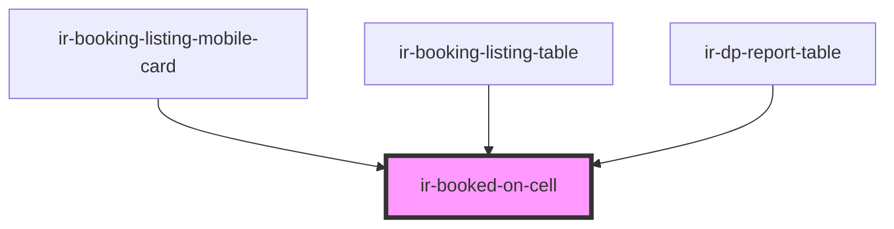

# ir-booked-on-cell

<!-- Auto Generated Below -->

## Properties

| Property   | Attribute   | Description | Type                  | Default     |
| ---------- | ----------- | ----------- | --------------------- | ----------- |
| `bookedOn` | --          |             | `DateTime`            | `undefined` |
| `display`  | `display`   |             | `"block" \| "inline"` | `'block'`   |
| `label`    | `label`     |             | `string`              | `undefined` |
| `showTime` | `show-time` |             | `boolean`             | `true`      |

## Dependencies

### Used by

 - [ir-booking-listing-mobile-card](../../../ir-booking-listing/ir-booking-listing-mobile-card)
 - [ir-booking-listing-table](../../../ir-booking-listing/ir-booking-listing-table)
 - [ir-dp-report-table](../../../ir-dp-report/ir-dp-report-table)

### Graph

----------------------------------------------

*Built with [StencilJS](https://stenciljs.com/)*
