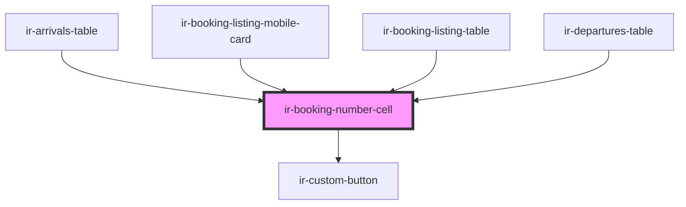

# ir-booking-number-cell

<!-- Auto Generated Below -->

## Properties

| Property               | Attribute                | Description                                           | Type     | Default     |
| ---------------------- | ------------------------ | ----------------------------------------------------- | -------- | ----------- |
| `bookingNumber`        | `booking-number`         |                                                       | `string` | `undefined` |
| `channelBookingNumber` | `channel-booking-number` |                                                       | `string` | `undefined` |
| `origin`               | --                       | Origin metadata containing label + icon used as logo. | `Origin` | `undefined` |
| `source`               | --                       | Source of the booking (e.g. website, channel).        | `Source` | `undefined` |

## Events

| Event                | Description | Type                  |
| -------------------- | ----------- | --------------------- |
| `openBookingDetails` |             | `CustomEvent<string>` |

## Dependencies

### Used by

 - [ir-arrivals-table](../../../ir-arrivals/ir-arrivals-table)
 - [ir-booking-listing-mobile-card](../../../ir-booking-listing/ir-booking-listing-mobile-card)
 - [ir-booking-listing-table](../../../ir-booking-listing/ir-booking-listing-table)
 - [ir-departures-table](../../../ir-departures/ir-departures-table)

### Depends on

- [ir-custom-button](../../../ui/ir-custom-button)

### Graph

----------------------------------------------

*Built with [StencilJS](https://stenciljs.com/)*
