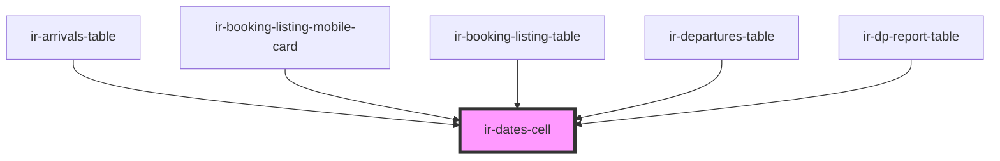

# ir-dates-cell

<!-- Auto Generated Below -->

## Properties

| Property          | Attribute          | Description                                                                          | Type                  | Default     |
| ----------------- | ------------------ | ------------------------------------------------------------------------------------ | --------------------- | ----------- |
| `checkIn`         | `check-in`         |                                                                                      | `string`              | `undefined` |
| `checkInLabel`    | `check-in-label`   |                                                                                      | `string`              | `undefined` |
| `checkOut`        | `check-out`        |                                                                                      | `string`              | `undefined` |
| `checkoutLabel`   | `checkout-label`   |                                                                                      | `string`              | `undefined` |
| `display`         | `display`          |                                                                                      | `"block" \| "inline"` | `'block'`   |
| `overdueCheckin`  | `overdue-checkin`  |                                                                                      | `boolean`             | `undefined` |
| `overdueCheckout` | `overdue-checkout` |                                                                                      | `boolean`             | `undefined` |
| `showArrow`       | `show-arrow`       | Shows a small arrow between check-in and check-out. Intended for `display="inline"`. | `boolean`             | `false`     |

## Dependencies

### Used by

 - [ir-arrivals-table](../../../ir-arrivals/ir-arrivals-table)
 - [ir-booking-listing-mobile-card](../../../ir-booking-listing/ir-booking-listing-mobile-card)
 - [ir-booking-listing-table](../../../ir-booking-listing/ir-booking-listing-table)
 - [ir-departures-table](../../../ir-departures/ir-departures-table)
 - [ir-dp-report-table](../../../ir-dp-report/ir-dp-report-table)

### Graph

----------------------------------------------

*Built with [StencilJS](https://stenciljs.com/)*
