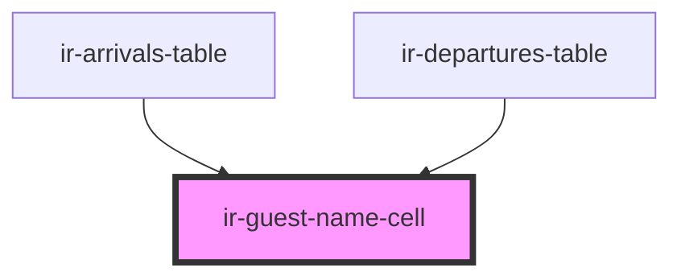

# ir-guest-name-cell

<!-- Auto Generated Below -->

## Properties

| Property | Attribute | Description | Type    | Default     |
| -------- | --------- | ----------- | ------- | ----------- |
| `name`   | --        |             | `Guest` | `undefined` |

## Dependencies

### Used by

 - [ir-arrivals-table](../../../ir-arrivals/ir-arrivals-table)
 - [ir-departures-table](../../../ir-departures/ir-departures-table)

### Graph

----------------------------------------------

*Built with [StencilJS](https://stenciljs.com/)*
