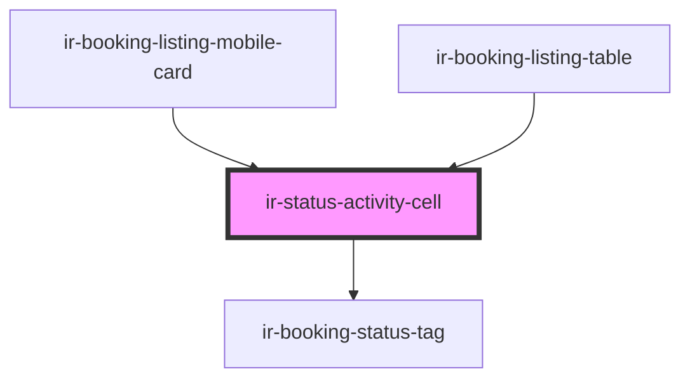

# ir-status-activity-cell

<!-- Auto Generated Below -->

## Properties

| Property                | Attribute                 | Description | Type                                                            | Default     |
| ----------------------- | ------------------------- | ----------- | --------------------------------------------------------------- | ----------- |
| `bookingNumber`         | `booking-number`          |             | `string`                                                        | `undefined` |
| `isRequestToCancel`     | `is-request-to-cancel`    |             | `boolean`                                                       | `undefined` |
| `lastManipulation`      | --                        |             | `{ user: string; date: string; hour: string; minute: string; }` | `undefined` |
| `showManipulationBadge` | `show-manipulation-badge` |             | `boolean`                                                       | `undefined` |
| `showModifiedBadge`     | `show-modified-badge`     |             | `boolean`                                                       | `undefined` |
| `status`                | --                        |             | `Status`                                                        | `undefined` |

## Dependencies

### Used by

 - [ir-booking-listing-mobile-card](../../../ir-booking-listing/ir-booking-listing-mobile-card)
 - [ir-booking-listing-table](../../../ir-booking-listing/ir-booking-listing-table)

### Depends on

- [ir-booking-status-tag](../../../ui/ir-booking-status-tag)

### Graph

----------------------------------------------

*Built with [StencilJS](https://stenciljs.com/)*
