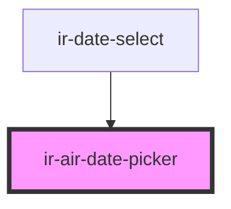

# ir-air-date-picker

<!-- Auto Generated Below -->

## Overview

`ir-air-date-picker` — a headless Stencil wrapper around the `air-datepicker` library.

The component renders nothing itself (`render()` returns `null`); on `componentDidLoad`
it instantiates an inline `AirDatepicker` calendar directly into the host element and
keeps it in sync with the `date` / `dates` / `minDate` / `maxDate` props via watchers.

Design notes:
- All prop-driven picker mutations use `{ silent: true }` so they never re-trigger
  `onSelect` → `dateChanged`, preventing parent ↔ child feedback loops.
- All date inputs (`string | Moment`) are normalized through {@link toMoment} before
  touching the picker, and value-compared (`isSameDates`) so re-renders of the parent
  with equal values are no-ops.
- The primary consumer is `ir-date-select`, which hosts this component inside its popup
  and forwards its own props one-to-one.

## Properties

| Property                | Attribute                 | Description                                                                                                                                                                                                                                      | Type                   | Default        |
| ----------------------- | ------------------------- | ------------------------------------------------------------------------------------------------------------------------------------------------------------------------------------------------------------------------------------------------ | ---------------------- | -------------- |
| `autoClose`             | `auto-close`              | Passed to AirDatepicker at init only. Has no visual effect on an inline calendar; the parent popup handles closing.                                                                                                                              | `boolean`              | `true`         |
| `container`             | --                        | Optional element AirDatepicker appends its calendar to (for positioning/styling). Defaults to the host.                                                                                                                                          | `HTMLElement`          | `undefined`    |
| `customPicker`          | `custom-picker`           | Not wired to the picker. Forwarded by `ir-date-select` (trigger rendering is the parent's concern).                                                                                                                                              | `boolean`              | `false`        |
| `date`                  | `date`                    | The selected date (single-select mode). Mutable: the component writes the latest selection back into it from `onSelect`, and the parent can set it to move the calendar selection programmatically (applied silently, no `dateChanged` emitted). | `Moment \| string`     | `null`         |
| `dateFormat`            | `date-format`             | Display format for the picker (AirDatepicker format tokens, not moment tokens). Passed at init only.                                                                                                                                             | `string`               | `'yyyy-MM-dd'` |
| `dates`                 | --                        | Pre-selected dates for multi-select/range mode. Takes precedence over `date` at initialization, and is re-applied through the `dates` watcher on change.                                                                                         | `(string \| Moment)[]` | `undefined`    |
| `disabled`              | `disabled`                | Not wired to the picker. Forwarded by `ir-date-select` (which handles disabling interaction itself).                                                                                                                                             | `boolean`              | `false`        |
| `emitEmptyDate`         | `emit-empty-date`         | If `true`, emits `dateChanged` with null values when the selection is cleared. Otherwise clear-events are swallowed.                                                                                                                             | `boolean`              | `false`        |
| `forceDestroyOnUpdate`  | `force-destroy-on-update` | If `true`, a `date` prop change destroys and rebuilds the AirDatepicker instance instead of calling `selectDate`. Use only when the picker must fully re-initialize; rebuilding on every change is expensive.                                    | `boolean`              | `false`        |
| `inline`                | `inline`                  | Not wired to the picker: the calendar is always created with `inline: true` (visibility is controlled by the parent `ir-date-select` popup).                                                                                                     | `boolean`              | `false`        |
| `label`                 | `label`                   | Not wired to the picker (this component renders no input). Forwarded by `ir-date-select` for API parity.                                                                                                                                         | `string`               | `undefined`    |
| `maxDate`               | `max-date`                | Latest selectable date. Reactive: changes call `datePicker.update()` while preserving the current selection.                                                                                                                                     | `Moment \| string`     | `undefined`    |
| `minDate`               | `min-date`                | Earliest selectable date. Reactive: changes call `datePicker.update()` while preserving the current selection.                                                                                                                                   | `Moment \| string`     | `undefined`    |
| `multipleDates`         | `multiple-dates`          | `true` for unlimited multi-select, or a number for a fixed max. Passed to AirDatepicker at init only.                                                                                                                                            | `boolean \| number`    | `false`        |
| `placeholder`           | `placeholder`             | Not wired to the picker (this component renders no input). Forwarded by `ir-date-select` for API parity.                                                                                                                                         | `string`               | `undefined`    |
| `range`                 | `range`                   | Enables range selection (start + end). Passed to AirDatepicker at init only.                                                                                                                                                                     | `boolean`              | `false`        |
| `selectOtherMonths`     | `select-other-months`     | Allows selecting the previous/next-month days shown in the current view. Passed at init only.                                                                                                                                                    | `boolean`              | `true`         |
| `showOtherMonths`       | `show-other-months`       | Shows days from the previous/next month in the current view. Passed at init only.                                                                                                                                                                | `boolean`              | `true`         |
| `timepicker`            | `timepicker`              | Enables the timepicker. Also switches `isSameDates` comparisons from day precision to minute precision.                                                                                                                                          | `boolean`              | `false`        |
| `triggerContainerStyle` | `trigger-container-style` | Not wired to the picker. Forwarded by `ir-date-select` for API parity.                                                                                                                                                                           | `string`               | `''`           |
| `withClear`             | `with-clear`              | Not wired to the picker. Accepted only for API parity with `ir-date-select`, which forwards all of its props.                                                                                                                                    | `boolean`              | `undefined`    |

## Events

| Event             | Description                                                                                                                                                                                   | Type                                                                      |
| ----------------- | --------------------------------------------------------------------------------------------------------------------------------------------------------------------------------------------- | ------------------------------------------------------------------------- |
| `dateChanged`     | Emitted when the user picks a date in the calendar (never for silent, prop-driven updates). `start`/`end` are equal in single-select mode; `dates` holds every selected date as `YYYY-MM-DD`. | `CustomEvent<{ start: Moment; end: Moment; dates: string \| string[]; }>` |
| `datePickerBlur`  | Emitted when the AirDatepicker reports `onHide`.                                                                                                                                              | `CustomEvent<void>`                                                       |
| `datePickerFocus` | Emitted when the AirDatepicker reports `onShow`.                                                                                                                                              | `CustomEvent<void>`                                                       |

## Methods

### `clearDatePicker() => Promise<void>`

Clears the calendar selection. Not silent: fires `onSelect` with an empty value (see `emitEmptyDate`).

#### Returns

Type: `Promise<void>`

### `syncSelection(options?: { date?: string | Moment | null; dates?: (string | Moment)[] | null; }) => Promise<void>`

Force-resyncs the calendar to the given (or current) value, bypassing the equality
checks the watchers perform. Escape hatch for parents whose prop value didn't change
but whose picker drifted (e.g. after a silent internal clear). Always silent.

#### Parameters

| Name      | Type                                                         | Description |
| --------- | ------------------------------------------------------------ | ----------- |
| `options` | `{ date?: string \| Moment; dates?: (string \| Moment)[]; }` |             |

#### Returns

Type: `Promise<void>`

## Dependencies

### Used by

 - [ir-date-select](../ir-date-select)

### Graph

----------------------------------------------

*Built with [StencilJS](https://stenciljs.com/)*
