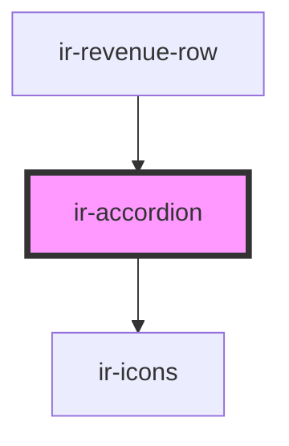

# ir-accordion

<!-- Auto Generated Below -->

## Properties

| Property          | Attribute          | Description                                                           | Type      | Default        |
| ----------------- | ------------------ | --------------------------------------------------------------------- | --------- | -------------- |
| `caret`           | `caret`            | Show caret icon                                                       | `boolean` | `true`         |
| `caretIcon`       | `caret-icon`       | Caret icon name                                                       | `string`  | `'angle-down'` |
| `defaultExpanded` | `default-expanded` | Start expanded                                                        | `boolean` | `false`        |
| `expanded`        | `expanded`         | Optional controlled prop: when provided, component follows this value | `boolean` | `undefined`    |

## Events

| Event       | Description                         | Type                                  |
| ----------- | ----------------------------------- | ------------------------------------- |
| `ir-toggle` | Fired after expansion state changes | `CustomEvent<{ expanded: boolean; }>` |

## Methods

### `hide() => Promise<void>`

#### Returns

Type: `Promise<void>`

### `show() => Promise<void>`

#### Returns

Type: `Promise<void>`

## Shadow Parts

| Part        | Description |
| ----------- | ----------- |
| `"base"`    |             |
| `"content"` |             |
| `"trigger"` |             |

## Dependencies

### Used by

 - [ir-revenue-row](../../ir-daily-revenue/ir-revenue-table/ir-revenue-row)

### Depends on

- [ir-icons](../ir-icons)

### Graph

----------------------------------------------

*Built with [StencilJS](https://stenciljs.com/)*
