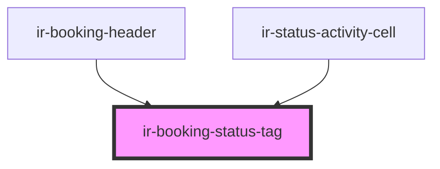

# ir-booking-status-tag

<!-- Auto Generated Below -->

## Properties

| Property            | Attribute              | Description | Type      | Default     |
| ------------------- | ---------------------- | ----------- | --------- | ----------- |
| `isRequestToCancel` | `is-request-to-cancel` |             | `boolean` | `undefined` |
| `status`            | --                     |             | `Status`  | `undefined` |

## Dependencies

### Used by

 - [ir-booking-header](../../ir-booking-details/ir-booking-header)
 - [ir-status-activity-cell](../../table-cells/booking/ir-status-activity-cell)

### Graph

----------------------------------------------

*Built with [StencilJS](https://stenciljs.com/)*
