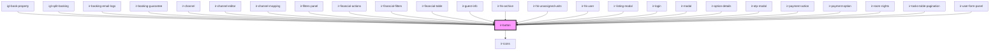

# ir-button

<!-- Auto Generated Below -->

## Properties

| Property                   | Attribute                     | Description                                                                      | Type                                                                                                                                                                                                                                                                                                                                                                                                                                                                                                                                                                                                                                                                                                                                                                                                                                                                              | Default     |
| -------------------------- | ----------------------------- | -------------------------------------------------------------------------------- | --------------------------------------------------------------------------------------------------------------------------------------------------------------------------------------------------------------------------------------------------------------------------------------------------------------------------------------------------------------------------------------------------------------------------------------------------------------------------------------------------------------------------------------------------------------------------------------------------------------------------------------------------------------------------------------------------------------------------------------------------------------------------------------------------------------------------------------------------------------------------------- | ----------- |
| `btnStyle`                 | --                            | Custom inline styles for the button element.                                     | `{ [key: string]: string; }`                                                                                                                                                                                                                                                                                                                                                                                                                                                                                                                                                                                                                                                                                                                                                                                                                                                      | `undefined` |
| `btn_block`                | `btn_block`                   | Whether the button should expand to the full width of its container.             | `boolean`                                                                                                                                                                                                                                                                                                                                                                                                                                                                                                                                                                                                                                                                                                                                                                                                                                                                         | `true`      |
| `btn_color`                | `btn_color`                   | The color theme of the button.                                                   | `"danger" \| "dark" \| "info" \| "light" \| "link" \| "outline" \| "primary" \| "secondary" \| "success" \| "warning"`                                                                                                                                                                                                                                                                                                                                                                                                                                                                                                                                                                                                                                                                                                                                                            | `'primary'` |
| `btn_disabled`             | `btn_disabled`                | Disables the button when set to true.                                            | `boolean`                                                                                                                                                                                                                                                                                                                                                                                                                                                                                                                                                                                                                                                                                                                                                                                                                                                                         | `false`     |
| `btn_id`                   | `btn_id`                      | A unique identifier for the button instance.                                     | `string`                                                                                                                                                                                                                                                                                                                                                                                                                                                                                                                                                                                                                                                                                                                                                                                                                                                                          | `v4()`      |
| `btn_styles`               | `btn_styles`                  | Additional custom class names for the button.                                    | `string`                                                                                                                                                                                                                                                                                                                                                                                                                                                                                                                                                                                                                                                                                                                                                                                                                                                                          | `undefined` |
| `btn_type`                 | `btn_type`                    | The button type attribute (`button`, `submit`, or `reset`).                      | `string`                                                                                                                                                                                                                                                                                                                                                                                                                                                                                                                                                                                                                                                                                                                                                                                                                                                                          | `'button'`  |
| `iconPosition`             | `icon-position`               | Position of the icon relative to the button text.                                | `"left" \| "right"`                                                                                                                                                                                                                                                                                                                                                                                                                                                                                                                                                                                                                                                                                                                                                                                                                                                               | `'left'`    |
| `icon_name`                | `icon_name`                   | The name of the icon to display.                                                 | `"angle-down" \| "angle-up" \| "angle_left" \| "angle_right" \| "angles_left" \| "angles_right" \| "arrow-right-from-bracket" \| "arrow-trend-down" \| "arrow-trend-up" \| "arrow_left" \| "arrow_right" \| "ban" \| "bell" \| "burger_menu" \| "calendar" \| "calendar-xmark" \| "check" \| "circle_check" \| "circle_info" \| "circle_plus" \| "clock" \| "closed_eye" \| "credit_card" \| "danger" \| "double_caret_left" \| "edit" \| "email" \| "envelope-circle-check" \| "eraser" \| "facebook" \| "file" \| "globe" \| "heart" \| "heart-fill" \| "home" \| "hotel" \| "instagram" \| "key" \| "menu_list" \| "minus" \| "note" \| "open_eye" \| "outline_user" \| "plus" \| "print" \| "reciept" \| "save" \| "search" \| "server" \| "square_plus" \| "trash" \| "twitter" \| "unlock" \| "user" \| "user_group" \| "whatsapp" \| "xmark" \| "xmark-fill" \| "youtube"` | `undefined` |
| `icon_style`               | `icon_style`                  | Custom style object for the icon.                                                | `any`                                                                                                                                                                                                                                                                                                                                                                                                                                                                                                                                                                                                                                                                                                                                                                                                                                                                             | `undefined` |
| `isLoading`                | `is-loading`                  | Displays a loading indicator when true and disables the button.                  | `boolean`                                                                                                                                                                                                                                                                                                                                                                                                                                                                                                                                                                                                                                                                                                                                                                                                                                                                         | `false`     |
| `labelStyle`               | --                            | Custom inline styles for the label/text inside the button.                       | `{ [key: string]: string; }`                                                                                                                                                                                                                                                                                                                                                                                                                                                                                                                                                                                                                                                                                                                                                                                                                                                      | `undefined` |
| `name`                     | `name`                        | The name of the button, used for identification purposes.                        | `string`                                                                                                                                                                                                                                                                                                                                                                                                                                                                                                                                                                                                                                                                                                                                                                                                                                                                          | `undefined` |
| `renderContentAsHtml`      | `render-content-as-html`      | If true, renders the text property as raw HTML inside the button.                | `boolean`                                                                                                                                                                                                                                                                                                                                                                                                                                                                                                                                                                                                                                                                                                                                                                                                                                                                         | `false`     |
| `size`                     | `size`                        | The size of the button.                                                          | `"lg" \| "md" \| "sm"`                                                                                                                                                                                                                                                                                                                                                                                                                                                                                                                                                                                                                                                                                                                                                                                                                                                            | `'md'`      |
| `text`                     | `text`                        | The text content displayed inside the button.                                    | `string`                                                                                                                                                                                                                                                                                                                                                                                                                                                                                                                                                                                                                                                                                                                                                                                                                                                                          | `undefined` |
| `textSize`                 | `text-size`                   | The size of the text inside the button.                                          | `"lg" \| "md" \| "sm"`                                                                                                                                                                                                                                                                                                                                                                                                                                                                                                                                                                                                                                                                                                                                                                                                                                                            | `'md'`      |
| `variant`                  | `variant`                     | Visual variant of the button: either standard (`default`) or icon-only (`icon`). | `"default" \| "icon"`                                                                                                                                                                                                                                                                                                                                                                                                                                                                                                                                                                                                                                                                                                                                                                                                                                                             | `'default'` |
| `visibleBackgroundOnHover` | `visible-background-on-hover` | If true, applies a visible background when hovered.                              | `boolean`                                                                                                                                                                                                                                                                                                                                                                                                                                                                                                                                                                                                                                                                                                                                                                                                                                                                         | `false`     |

## Events

| Event          | Description                                            | Type               |
| -------------- | ------------------------------------------------------ | ------------------ |
| `clickHandler` | Emits a custom click event when the button is clicked. | `CustomEvent<any>` |

## Methods

### `bounce() => Promise<void>`

Triggers a bounce animation on the button.

#### Returns

Type: `Promise<void>`

## Dependencies

### Used by

 - [igl-book-property](../../igloo-calendar/igl-book-property)
 - [igl-split-booking](../../igloo-calendar/igl-split-booking)
 - [ir-booking-email-logs](../../ir-booking-email-logs)
 - [ir-booking-guarantee](../../ir-booking-details/ir-payment-details/ir-booking-guarantee)
 - [ir-channel](../../ir-channel)
 - [ir-channel-editor](../../ir-channel/ir-channel-editor)
 - [ir-channel-mapping](../../ir-channel/ir-channel-mapping)
 - [ir-filters-panel](../ir-filters-panel)
 - [ir-financial-actions](../../ir-financial-actions)
 - [ir-financial-filters](../../ir-financial-actions/ir-financial-filters)
 - [ir-financial-table](../../ir-financial-actions/ir-financial-table)
 - [ir-guest-info](../../ir-guest-info)
 - [ir-hk-archive](../../ir-housekeeping/ir-hk-tasks/ir-hk-archive)
 - [ir-hk-unassigned-units](../../ir-housekeeping/ir-hk-unassigned-units)
 - [ir-hk-user](../../ir-housekeeping/ir-hk-user)
 - [ir-listing-modal](../../ir-booking-listing/ir-listing-modal)
 - [ir-login](../../ir-login)
 - [ir-modal](../ir-modal)
 - [ir-option-details](../../ir-payment-option/ir-option-details)
 - [ir-otp-modal](../../ir-otp-modal)
 - [ir-payment-action](../../ir-booking-details/ir-payment-details/ir-payment-actions/ir-payment-action)
 - [ir-payment-option](../../ir-payment-option)
 - [ir-room-nights](../../igloo-calendar/ir-room-nights)
 - [ir-tasks-table-pagination](../../ir-housekeeping/ir-hk-tasks/ir-tasks-table/ir-tasks-table-pagination)
 - [ir-user-form-panel](../../ir-user-management/ir-user-form-panel)

### Depends on

- [ir-icons](../ir-icons)

### Graph

```mermaid
graph TD;
  ir-button --> ir-icons
  igl-book-property --> ir-button
  igl-split-booking --> ir-button
  ir-booking-email-logs --> ir-button
  ir-booking-guarantee --> ir-button
  ir-channel --> ir-button
  ir-channel-editor --> ir-button
  ir-channel-mapping --> ir-button
  ir-filters-panel --> ir-button
  ir-financial-actions --> ir-button
  ir-financial-filters --> ir-button
  ir-financial-table --> ir-button
  ir-guest-info --> ir-button
  ir-hk-archive --> ir-button
  ir-hk-unassigned-units --> ir-button
  ir-hk-user --> ir-button
  ir-listing-modal --> ir-button
  ir-login --> ir-button
  ir-modal --> ir-button
  ir-option-details --> ir-button
  ir-otp-modal --> ir-button
  ir-payment-action --> ir-button
  ir-payment-option --> ir-button
  ir-room-nights --> ir-button
  ir-tasks-table-pagination --> ir-button
  ir-user-form-panel --> ir-button
  style ir-button fill:#f9f,stroke:#333,stroke-width:4px
```

----------------------------------------------

*Built with [StencilJS](https://stenciljs.com/)*
