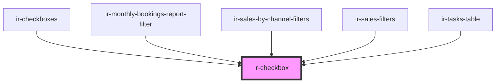

# ir-checkbox

<!-- Auto Generated Below -->

## Properties

| Property        | Attribute       | Description                                                   | Type      | Default     |
| --------------- | --------------- | ------------------------------------------------------------- | --------- | ----------- |
| `checkboxId`    | `checkbox-id`   | The unique ID of the checkbox element.                        | `string`  | `v4()`      |
| `checked`       | `checked`       | Whether the checkbox is checked.                              | `boolean` | `false`     |
| `disabled`      | `disabled`      | Disables the checkbox when true.                              | `boolean` | `undefined` |
| `indeterminate` | `indeterminate` | Whether the checkbox is in an indeterminate state.            | `boolean` | `undefined` |
| `label`         | `label`         | The label text associated with the checkbox.                  | `string`  | `undefined` |
| `labelClass`    | `label-class`   | CSS class applied to the label element.                       | `string`  | `undefined` |
| `name`          | `name`          | The name attribute of the checkbox, used for form submission. | `string`  | `undefined` |

## Events

| Event         | Description                                        | Type                   |
| ------------- | -------------------------------------------------- | ---------------------- |
| `checkChange` | Emitted when the checkbox's checked state changes. | `CustomEvent<boolean>` |

## Dependencies

### Used by

 - [ir-checkboxes](../ir-checkboxes)
 - [ir-monthly-bookings-report-filter](../../ir-monthly-bookings-report/ir-monthly-bookings-report-filter)
 - [ir-sales-by-channel-filters](../../ir-sales-by-channel/ir-sales-by-channel-filters)
 - [ir-sales-filters](../../ir-sales-by-country/ir-sales-filters)
 - [ir-tasks-table](../../ir-housekeeping/ir-hk-tasks/ir-tasks-table)

### Graph

----------------------------------------------

*Built with [StencilJS](https://stenciljs.com/)*
