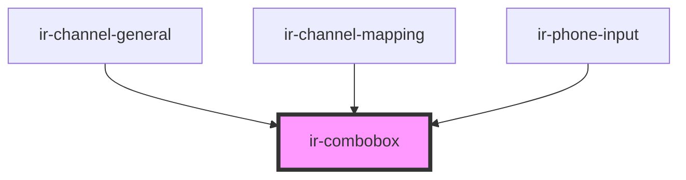

# ir-combobox

<!-- Auto Generated Below -->

## Properties

| Property      | Attribute     | Description                                         | Type             | Default     |
| ------------- | ------------- | --------------------------------------------------- | ---------------- | ----------- |
| `autoFocus`   | `auto-focus`  | Autofocuses the input field when true.              | `boolean`        | `false`     |
| `data`        | --            | The list of items displayed in the combobox.        | `ComboboxItem[]` | `[]`        |
| `disabled`    | `disabled`    | Disables the combobox input when set to true.       | `boolean`        | `false`     |
| `duration`    | `duration`    | Debounce duration in milliseconds for search input. | `number`         | `300`       |
| `input_id`    | `input_id`    | Unique identifier for the input element.            | `string`         | `v4()`      |
| `placeholder` | `placeholder` | Placeholder text for the input field.               | `string`         | `undefined` |
| `value`       | `value`       | The current value of the input field.               | `string`         | `undefined` |

## Events

| Event                 | Description                                         | Type                                                                                                 |
| --------------------- | --------------------------------------------------- | ---------------------------------------------------------------------------------------------------- |
| `comboboxValueChange` | Emitted when a selection is made from the combobox. | `CustomEvent<{ key: string; data: unknown; }>`                                                       |
| `inputCleared`        | Emitted when the input is cleared by the user.      | `CustomEvent<null>`                                                                                  |
| `toast`               | Emits a toast notification.                         | `CustomEvent<ICustomToast & Partial<IToastWithButton> \| IDefaultToast & Partial<IToastWithButton>>` |

## Dependencies

### Used by

 - [ir-channel-general](../../ir-channel/ir-channel-general)
 - [ir-channel-mapping](../../ir-channel/ir-channel-mapping)
 - [ir-phone-input](../ir-phone-input)

### Graph

----------------------------------------------

*Built with [StencilJS](https://stenciljs.com/)*
