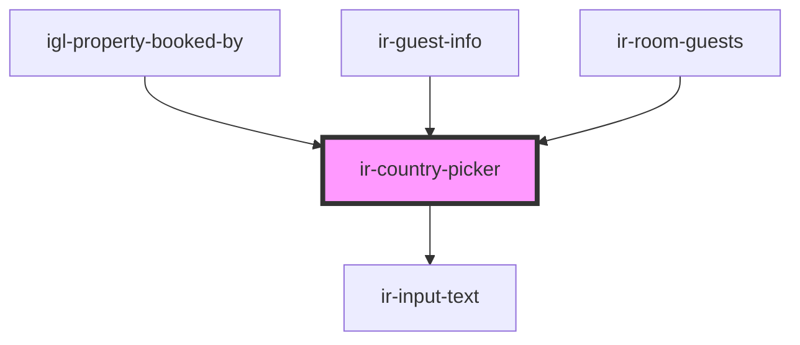

# ir-country-picker

<!-- Auto Generated Below -->

## Properties

| Property          | Attribute       | Description                                                    | Type         | Default     |
| ----------------- | --------------- | -------------------------------------------------------------- | ------------ | ----------- |
| `autoValidate`    | `auto-validate` | Whether to automatically validate the input.                   | `boolean`    | `false`     |
| `countries`       | --              | List of countries to display in the dropdown.                  | `ICountry[]` | `[]`        |
| `country`         | --              | Currently selected country.                                    | `ICountry`   | `undefined` |
| `error`           | `error`         | Whether to show an error state on the input.                   | `boolean`    | `undefined` |
| `label`           | `label`         | The label to display for the input.                            | `string`     | `undefined` |
| `propertyCountry` | --              | The property-associated country, shown separately if relevant. | `ICountry`   | `undefined` |
| `testId`          | `test-id`       | Test ID for automated testing.                                 | `string`     | `undefined` |

## Events

| Event           | Description                               | Type                    |
| --------------- | ----------------------------------------- | ----------------------- |
| `countryChange` | Event emitted when a country is selected. | `CustomEvent<ICountry>` |

## Dependencies

### Used by

 - [igl-property-booked-by](../../igloo-calendar/igl-book-property/igl-booking-form/igl-property-booked-by)
 - [ir-guest-info](../../ir-guest-info)
 - [ir-room-guests](../../ir-booking-details/ir-room-guests)

### Depends on

- [ir-input-text](../ir-input-text)

### Graph

----------------------------------------------

*Built with [StencilJS](https://stenciljs.com/)*
