# ir-custom-button

<!-- Auto Generated Below -->

## Properties

| Property         | Attribute          | Description                                                                                                                                                                                                          | Type                                                                           | Default     |
| ---------------- | ------------------ | -------------------------------------------------------------------------------------------------------------------------------------------------------------------------------------------------------------------- | ------------------------------------------------------------------------------ | ----------- |
| `appearance`     | `appearance`       | The button's visual appearance.                                                                                                                                                                                      | `"accent" \| "filled" \| "filled-outlined" \| "outlined" \| "plain"`           | `undefined` |
| `disabled`       | `disabled`         | Disables the button. Does not apply to link buttons.                                                                                                                                                                 | `boolean`                                                                      | `undefined` |
| `download`       | `download`         | Tells the browser to download the linked file as this filename. Only used when `href` is present.                                                                                                                    | `string`                                                                       | `undefined` |
| `form`           | `form`             | The "form owner" to associate the button with. If omitted, the closest containing form will be used instead. The value of this attribute must be an id of a form in the same document or shadow root as the button.  | `string`                                                                       | `undefined` |
| `formAction`     | `form-action`      | Used to override the form owner's `action` attribute.                                                                                                                                                                | `string`                                                                       | `undefined` |
| `formEnctype`    | `form-enctype`     | Used to override the form owner's `enctype` attribute.                                                                                                                                                               | `"application/x-www-form-urlencoded" \| "multipart/form-data" \| "text/plain"` | `undefined` |
| `formMethod`     | `form-method`      | Used to override the form owner's `method` attribute.                                                                                                                                                                | `"get" \| "post"`                                                              | `undefined` |
| `formNoValidate` | `form-no-validate` | Used to override the form owner's `novalidate` attribute.                                                                                                                                                            | `boolean`                                                                      | `undefined` |
| `formTarget`     | `form-target`      | Used to override the form owner's `target` attribute.                                                                                                                                                                | `string`                                                                       | `undefined` |
| `href`           | `href`             | When set, the underlying button will be rendered as an `<a>` with this `href` instead of a `<button>`.                                                                                                               | `string`                                                                       | `undefined` |
| `iconBtn`        | `icon-btn`         |                                                                                                                                                                                                                      | `boolean`                                                                      | `undefined` |
| `loading`        | `loading`          | Draws the button in a loading state.                                                                                                                                                                                 | `boolean`                                                                      | `undefined` |
| `name`           | `name`             | The name of the button, submitted as a name/value pair with form data, but only when this button is the submitter. This attribute is ignored when `href` is present.                                                 | `string`                                                                       | `undefined` |
| `pill`           | `pill`             | Draws a pill-style button with rounded edges.                                                                                                                                                                        | `boolean`                                                                      | `undefined` |
| `rel`            | `rel`              | When using `href`, this attribute will map to the underlying link's `rel` attribute.                                                                                                                                 | `string`                                                                       | `undefined` |
| `size`           | `size`             | The button's size.                                                                                                                                                                                                   | `"large" \| "medium" \| "small"`                                               | `'small'`   |
| `target`         | `target`           | Tells the browser where to open the link. Only used when `href` is present.                                                                                                                                          | `"_blank" \| "_parent" \| "_self" \| "_top"`                                   | `undefined` |
| `type`           | `type`             | The type of button. Note that the default value is `button` instead of `submit`, which is opposite of how native `<button>` elements behave. When the type is `submit`, the button will submit the surrounding form. | `"button" \| "reset" \| "submit"`                                              | `'button'`  |
| `value`          | `value`            | The value of the button, submitted as a pair with the button's name as part of the form data, but only when this button is the submitter. This attribute is ignored when `href` is present.                          | `string`                                                                       | `undefined` |
| `variant`        | `variant`          | The button's theme variant. Defaults to `neutral` if not within another element with a variant.                                                                                                                      | `"brand" \| "danger" \| "neutral" \| "success" \| "warning"`                   | `undefined` |
| `withCaret`      | `with-caret`       | Draws the button with a caret. Used to indicate that the button triggers a dropdown menu or similar behavior.                                                                                                        | `boolean`                                                                      | `undefined` |

## Events

| Event          | Description | Type                      |
| -------------- | ----------- | ------------------------- |
| `clickHandler` |             | `CustomEvent<MouseEvent>` |

## Dependencies

### Used by

 - [igl-reallocation-dialog](../../igloo-calendar/igl-reallocation-dialog)
 - [ir-applicable-policies](../../ir-booking-details/ir-payment-details/ir-applicable-policies)
 - [ir-booking-company-form](../../ir-booking-details/ir-booking-company-form)
 - [ir-booking-details](../../ir-booking-details)
 - [ir-booking-header](../../ir-booking-details/ir-booking-header)
 - [ir-extra-service](../../ir-booking-details/ir-extra-services/ir-extra-service)
 - [ir-extra-services](../../ir-booking-details/ir-extra-services)
 - [ir-payment-folio](../../ir-booking-details/ir-payment-details/ir-payment-folio)
 - [ir-payment-item](../../ir-booking-details/ir-payment-details/ir-payment-item)
 - [ir-payments-folio](../../ir-booking-details/ir-payment-details/ir-payments-folio)
 - [ir-pickup-view](../../ir-booking-details/ir-pickup-view)
 - [ir-reservation-information](../../ir-booking-details/ir-reservation-information)
 - [ir-room](../../ir-booking-details/ir-room)

### Graph

```mermaid
graph TD;
  igl-reallocation-dialog --> ir-custom-button
  ir-applicable-policies --> ir-custom-button
  ir-booking-company-form --> ir-custom-button
  ir-booking-details --> ir-custom-button
  ir-booking-header --> ir-custom-button
  ir-extra-service --> ir-custom-button
  ir-extra-services --> ir-custom-button
  ir-payment-folio --> ir-custom-button
  ir-payment-item --> ir-custom-button
  ir-payments-folio --> ir-custom-button
  ir-pickup-view --> ir-custom-button
  ir-reservation-information --> ir-custom-button
  ir-room --> ir-custom-button
  style ir-custom-button fill:#f9f,stroke:#333,stroke-width:4px
```

----------------------------------------------

*Built with [StencilJS](https://stenciljs.com/)*
