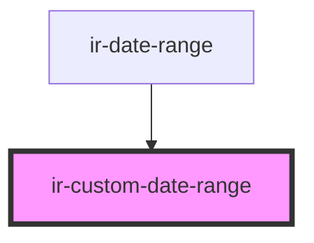

# ir-date-range

<!-- Auto Generated Below -->

## Properties

| Property        | Attribute       | Description                                                                                                                 | Type             | Default                      |
| --------------- | --------------- | --------------------------------------------------------------------------------------------------------------------------- | ---------------- | ---------------------------- |
| `dateModifiers` | --              | An optional map of `YYYY-MM-DD` → `IDateModifierOptions` used to mark specific dates as unavailable or attach pricing data. | `IDateModifiers` | `undefined`                  |
| `fromDate`      | --              | The currently selected check-in date.                                                                                       | `Moment`         | `null`                       |
| `locale`        | `locale`        | BCP-47 locale tag used to localise day names and month formatting.                                                          | `string`         | `'en'`                       |
| `maxDate`       | --              | The latest selectable date. Defaults to 24 years in the future.                                                             | `Moment`         | `moment().add(24, 'years')`  |
| `maxSpanDays`   | `max-span-days` | Maximum number of nights that can be selected in one span.                                                                  | `number`         | `90`                         |
| `minDate`       | --              | The earliest selectable date. Defaults to 24 years in the past.                                                             | `Moment`         | `moment().add(-24, 'years')` |
| `showPrice`     | `show-price`    | When `true`, displays a price line inside each day button (requires `dateModifiers`).                                       | `boolean`        | `false`                      |
| `toDate`        | --              | The currently selected check-out date.                                                                                      | `Moment`         | `null`                       |

## Events

| Event        | Description                                                                                                                    | Type                                       |
| ------------ | ------------------------------------------------------------------------------------------------------------------------------ | ------------------------------------------ |
| `dateChange` | Emits the selected start and end dates as native `Date` objects. `end` is `null` when the user has only picked the first date. | `CustomEvent<{ start: Date; end: Date; }>` |

## Shadow Parts

| Part                 | Description |
| -------------------- | ----------- |
| `"base"`             |             |
| `"calendar"`         |             |
| `"calendar-header"`  |             |
| `"day-button"`       |             |
| `"day-cell"`         |             |
| `"days-grid"`        |             |
| `"month-label"`      |             |
| `"month-navigation"` |             |
| `"nav-next"`         |             |
| `"nav-prev"`         |             |
| `"week-row"`         |             |
| `"weekday"`          |             |
| `"weekday-row"`      |             |

## Dependencies

### Used by

 - [ir-date-range](../ir-date-range)

### Graph

----------------------------------------------

*Built with [StencilJS](https://stenciljs.com/)*
