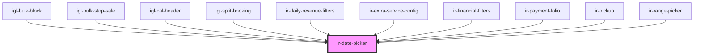

# ir-date-picker

<!-- Auto Generated Below -->

## Properties

| Property                | Attribute                 | Description                                                                                                                                                                                                                                                                            | Type                | Default        |
| ----------------------- | ------------------------- | -------------------------------------------------------------------------------------------------------------------------------------------------------------------------------------------------------------------------------------------------------------------------------------- | ------------------- | -------------- |
| `autoClose`             | `auto-close`              | Closes the picker automatically after a date is selected.                                                                                                                                                                                                                              | `boolean`           | `true`         |
| `container`             | --                        | Pass a container element if you need the date picker to be appended to a specific element for styling or positioning (particularly for arrow rendering). If not provided, it defaults to `this.el`.                                                                                    | `HTMLElement`       | `undefined`    |
| `customPicker`          | `custom-picker`           | Controls how the date picker is triggered. - **`true`**: The picker can be triggered by custom UI elements (provided via a `<slot name="trigger">`). - **`false`**: A default button input is used to open the picker.  Defaults to `true`.                                            | `boolean`           | `true`         |
| `date`                  | `date`                    | The initially selected date; can be a `Date` object or a string recognized by `AirDatepicker`.                                                                                                                                                                                         | `Date \| string`    | `null`         |
| `dateFormat`            | `date-format`             | Format for the date as it appears in the input field. Follows the `AirDatepicker` format rules.                                                                                                                                                                                        | `string`            | `'yyyy-MM-dd'` |
| `disabled`              | `disabled`                | Disables the input and prevents interaction.                                                                                                                                                                                                                                           | `boolean`           | `false`        |
| `emitEmptyDate`         | `emit-empty-date`         | If `true`, the component will emit a `dateChanged` event when the selected date becomes empty (null). Otherwise, empty-date changes will be ignored (no event emitted).  Defaults to `false`.                                                                                          | `boolean`           | `false`        |
| `forceDestroyOnUpdate`  | `force-destroy-on-update` | If `true`, the date picker instance is destroyed and rebuilt each time the `date` prop changes. This can be useful if you need the picker to fully re-initialize in response to dynamic changes, but note that it may affect performance if triggered frequently. Defaults to `false`. | `boolean`           | `false`        |
| `inline`                | `inline`                  | Determines whether the date picker is rendered inline or in a pop-up. If `true`, the picker is always visible inline.                                                                                                                                                                  | `boolean`           | `false`        |
| `maxDate`               | `max-date`                | The latest date that can be selected.                                                                                                                                                                                                                                                  | `Date \| string`    | `undefined`    |
| `minDate`               | `min-date`                | The earliest date that can be selected.                                                                                                                                                                                                                                                | `Date \| string`    | `undefined`    |
| `multipleDates`         | `multiple-dates`          | Enables multiple dates. If `true`, multiple selection is allowed. If you pass a number (e.g. 3), that is the maximum number of selectable dates.                                                                                                                                       | `boolean \| number` | `false`        |
| `range`                 | `range`                   | Whether the picker should allow range selection (start and end date).                                                                                                                                                                                                                  | `boolean`           | `false`        |
| `selectOtherMonths`     | `select-other-months`     | Allows selecting days from previous/next month shown in the current view.                                                                                                                                                                                                              | `boolean`           | `true`         |
| `showOtherMonths`       | `show-other-months`       | Shows days from previous/next month in the current month's calendar.                                                                                                                                                                                                                   | `boolean`           | `true`         |
| `timepicker`            | `timepicker`              | Enables the timepicker functionality (select hours and minutes).                                                                                                                                                                                                                       | `boolean`           | `false`        |
| `triggerContainerStyle` | `trigger-container-style` | Styles for the trigger container                                                                                                                                                                                                                                                       | `string`            | `''`           |

## Events

| Event             | Description | Type                                           |
| ----------------- | ----------- | ---------------------------------------------- |
| `dateChanged`     |             | `CustomEvent<{ start: Moment; end: Moment; }>` |
| `datePickerBlur`  |             | `CustomEvent<void>`                            |
| `datePickerFocus` |             | `CustomEvent<void>`                            |

## Methods

### `clearDatePicker() => Promise<void>`

#### Returns

Type: `Promise<void>`

### `openDatePicker() => Promise<void>`

#### Returns

Type: `Promise<void>`

## Dependencies

### Used by

 - [igl-bulk-block](../../igloo-calendar/igl-bulk-operations/igl-bulk-block)
 - [igl-bulk-stop-sale](../../igloo-calendar/igl-bulk-operations/igl-bulk-stop-sale)
 - [igl-cal-header](../../igloo-calendar/igl-cal-header)
 - [igl-split-booking](../../igloo-calendar/igl-split-booking)
 - [ir-daily-revenue-filters](../../ir-daily-revenue/ir-daily-revenue-filters)
 - [ir-extra-service-config](../../ir-booking-details/ir-extra-services/ir-extra-service-config)
 - [ir-financial-filters](../../ir-financial-actions/ir-financial-filters)
 - [ir-payment-folio](../../ir-booking-details/ir-payment-details/ir-payment-folio)
 - [ir-pickup](../../ir-booking-details/ir-pickup)
 - [ir-range-picker](../../ir-housekeeping/ir-hk-tasks/ir-hk-archive/ir-range-picker)

### Graph

----------------------------------------------

*Built with [StencilJS](https://stenciljs.com/)*
