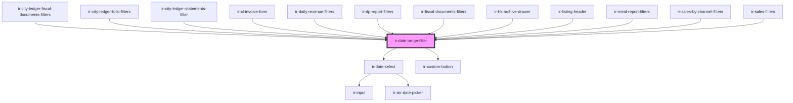

# ir-date-range-filter

<!-- Auto Generated Below -->

## Overview

`ir-date-range-filter` — a from/to date-range field for filter toolbars.

Composition: each side renders a text button (shows the value, opens the popup),
an optional clear button, and an `ir-date-select` whose popup hosts the calendar
plus optional quick-date preset buttons.

State model: the component is *optionally controlled*. If `fromDate`/`toDate` are
provided they seed and (via watchers) overwrite the internal `dates` state; either
side can be controlled independently. Internal selections always update local state
and emit `datesChanged` — a controlling parent is expected to echo the value back.

Range integrity is enforced two ways:
- the from-calendar's max is capped at the to-date and the to-calendar's min is
  floored at the from-date (see {@link getFromMaxDate }/{@link getToMinDate}),
- quick-date presets that would invert the range are disabled.

Styling: all inner pieces are exposed as CSS parts; the parts of each inner
`ir-date-select` are re-exported with `from-`/`to-` prefixes (e.g. `from-body`).

## Properties

| Property           | Attribute            | Description                                                                                                                                                                                                                                                                                                                                                                                                                      | Type                    | Default                                                                                                                                                                                                                                                                                                                                                                |
| ------------------ | -------------------- | -------------------------------------------------------------------------------------------------------------------------------------------------------------------------------------------------------------------------------------------------------------------------------------------------------------------------------------------------------------------------------------------------------------------------------- | ----------------------- | ---------------------------------------------------------------------------------------------------------------------------------------------------------------------------------------------------------------------------------------------------------------------------------------------------------------------------------------------------------------------- |
| `fromDate`         | `from-date`          | Controlled start date in YYYY-MM-DD format.                                                                                                                                                                                                                                                                                                                                                                                      | `string`                | `undefined`                                                                                                                                                                                                                                                                                                                                                            |
| `label`            | `label`              | Visible label rendered above the control. It names the group for assistive technology (replacing the default visually-hidden "Date range selector") and, like a native form label, clicking it opens the from-date picker.                                                                                                                                                                                                       | `string`                | `undefined`                                                                                                                                                                                                                                                                                                                                                            |
| `maxDate`          | `max-date`           | Latest selectable date in YYYY-MM-DD format. Applied to both calendars.                                                                                                                                                                                                                                                                                                                                                          | `string`                | `undefined`                                                                                                                                                                                                                                                                                                                                                            |
| `minDate`          | `min-date`           | Earliest selectable date in YYYY-MM-DD format. Applied to both calendars.                                                                                                                                                                                                                                                                                                                                                        | `string`                | `undefined`                                                                                                                                                                                                                                                                                                                                                            |
| `quickDates`       | --                   | Configurable quick-date preset buttons shown alongside each calendar.                                                                                                                                                                                                                                                                                                                                                            | `QuickDatePreset[]`     | `[     { label: 'Today', getDate: () => moment() },     { label: '30 Days Ago', getDate: () => moment().subtract(30, 'days') },     { label: '60 Days Ago', getDate: () => moment().subtract(60, 'days') },     { label: '90 Days Ago', getDate: () => moment().subtract(90, 'days') },     { label: '1 Year Ago', getDate: () => moment().subtract(1, 'year') },   ]` |
| `quickDatesMode`   | `quick-dates-mode`   | How a quick-date preset behaves when picked from the *to* side: - `'absolute'` (default): sets only the to-date to `preset.getDate()`, same as the from side. - `'range'`: treats `preset.getDate()` as a "N units ago" anchor — sets from-date to   `preset.getDate()` and to-date to today, so e.g. "7 Days Ago" becomes a "last 7 days" range.   The from side is unaffected by this prop; it always sets only the from-date. | `"absolute" \| "range"` | `'absolute'`                                                                                                                                                                                                                                                                                                                                                           |
| `selectionMode`    | `selection-mode`     | Flow after picking a from-date: - `'auto'`: the to-picker opens automatically so the user completes the range in one pass. - `'manual'` (default): nothing opens; the user clicks the to-field themselves.                                                                                                                                                                                                                       | `"auto" \| "manual"`    | `'manual'`                                                                                                                                                                                                                                                                                                                                                             |
| `showQuickActions` | `show-quick-actions` | Whether to show the quick-action preset buttons in each calendar popup.                                                                                                                                                                                                                                                                                                                                                          | `boolean`               | `true`                                                                                                                                                                                                                                                                                                                                                                 |
| `size`             | `size`               | Size variant passed through to inner form controls. Reflected for CSS hooks (`ir-date-range-filter[size='...']`).                                                                                                                                                                                                                                                                                                                | `string`                | `'s'`                                                                                                                                                                                                                                                                                                                                                                  |
| `toDate`           | `to-date`            | Controlled end date in YYYY-MM-DD format.                                                                                                                                                                                                                                                                                                                                                                                        | `string`                | `undefined`                                                                                                                                                                                                                                                                                                                                                            |
| `withClear`        | `with-clear`         | Shows an ✕ button next to each filled side that clears just that side.                                                                                                                                                                                                                                                                                                                                                           | `boolean`               | `true`                                                                                                                                                                                                                                                                                                                                                                 |

## Events

| Event          | Description                                                                                 | Type                                         |
| -------------- | ------------------------------------------------------------------------------------------- | -------------------------------------------- |
| `dateCleared`  | Fired when the user explicitly clears a date field (after the accompanying `datesChanged`). | `CustomEvent<{ field: "from" \| "to"; }>`    |
| `datesChanged` | Fired whenever either date changes. Payload contains ISO date strings or null.              | `CustomEvent<{ from: string; to: string; }>` |

## Shadow Parts

| Part              | Description |
| ----------------- | ----------- |
| `"cal-trigger"`   |             |
| `"clear-btn"`     |             |
| `"container"`     |             |
| `"divider"`       |             |
| `"field"`         |             |
| `"field-from"`    |             |
| `"field-to"`      |             |
| `"label"`         |             |
| `"quick-actions"` |             |
| `"text-btn"`      |             |

## Dependencies

### Used by

 - [ir-city-ledger-fiscal-documents-filters](../../ir-city-ledger/ir-city-ledger-fiscal-documents/ir-city-ledger-fiscal-documents-filters)
 - [ir-city-ledger-folio-filters](../../ir-city-ledger/ir-city-ledger-folio/ir-city-ledger-folio-filters)
 - [ir-city-ledger-statements-filter](../../ir-city-ledger/ir-city-ledger-statements/ir-city-ledger-statements-filter)
 - [ir-cl-invoice-form](../../ir-city-ledger/ir-cl-invoice-dialog/ir-cl-invoice-form)
 - [ir-daily-revenue-filters](../../ir-daily-revenue/ir-daily-revenue-filters)
 - [ir-dp-report-filters](../../ir-dp-report/ir-dp-report-filters)
 - [ir-fiscal-documents-filters](../../ir-fiscal-documents/ir-fiscal-documents-filters)
 - [ir-hk-archive-drawer](../../ir-housekeeping/ir-hk-tasks/ir-hk-archive-drawer)
 - [ir-listing-header](../../ir-booking-listing/ir-listing-header)
 - [ir-meal-report-filters](../../ir-meal-report/ir-meal-report-filters)
 - [ir-sales-by-channel-filters](../../ir-sales-by-channel/ir-sales-by-channel-filters)
 - [ir-sales-filters](../../ir-sales-by-country/ir-sales-filters)

### Depends on

- [ir-date-select](../date-picker/ir-date-select)
- [ir-custom-button](../ir-custom-button)

### Graph

----------------------------------------------

*Built with [StencilJS](https://stenciljs.com/)*
