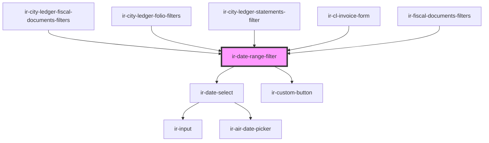

# ir-date-range-filter

<!-- Auto Generated Below -->

## Properties

| Property           | Attribute            | Description                                                             | Type                | Default                                                                                                                                                                                                                                                                                                                                                                |
| ------------------ | -------------------- | ----------------------------------------------------------------------- | ------------------- | ---------------------------------------------------------------------------------------------------------------------------------------------------------------------------------------------------------------------------------------------------------------------------------------------------------------------------------------------------------------------- |
| `fromDate`         | `from-date`          | Controlled start date in YYYY-MM-DD format.                             | `string`            | `undefined`                                                                                                                                                                                                                                                                                                                                                            |
| `maxDate`          | `max-date`           | Latest selectable date in YYYY-MM-DD format.                            | `string`            | `undefined`                                                                                                                                                                                                                                                                                                                                                            |
| `minDate`          | `min-date`           | Earliest selectable date in YYYY-MM-DD format.                          | `string`            | `undefined`                                                                                                                                                                                                                                                                                                                                                            |
| `quickDates`       | --                   | Configurable quick-date preset buttons shown alongside each calendar.   | `QuickDatePreset[]` | `[     { label: 'Today', getDate: () => moment() },     { label: '30 Days Ago', getDate: () => moment().subtract(30, 'days') },     { label: '60 Days Ago', getDate: () => moment().subtract(60, 'days') },     { label: '90 Days Ago', getDate: () => moment().subtract(90, 'days') },     { label: '1 Year Ago', getDate: () => moment().subtract(1, 'year') },   ]` |
| `showQuickActions` | `show-quick-actions` | Whether to show the quick-action preset buttons in each calendar popup. | `boolean`           | `true`                                                                                                                                                                                                                                                                                                                                                                 |
| `size`             | `size`               | Size variant passed through to inner form controls.                     | `string`            | `'small'`                                                                                                                                                                                                                                                                                                                                                              |
| `toDate`           | `to-date`            | Controlled end date in YYYY-MM-DD format.                               | `string`            | `undefined`                                                                                                                                                                                                                                                                                                                                                            |

## Events

| Event          | Description                                                                    | Type                                         |
| -------------- | ------------------------------------------------------------------------------ | -------------------------------------------- |
| `dateCleared`  | Fired when the user explicitly clears a date field.                            | `CustomEvent<{ field: "from" \| "to"; }>`    |
| `datesChanged` | Fired whenever either date changes. Payload contains ISO date strings or null. | `CustomEvent<{ from: string; to: string; }>` |

## Shadow Parts

| Part              | Description |
| ----------------- | ----------- |
| `"cal-trigger"`   |             |
| `"clear-btn"`     |             |
| `"container"`     |             |
| `"divider"`       |             |
| `"field"`         |             |
| `"field-from"`    |             |
| `"field-to"`      |             |
| `"quick-actions"` |             |
| `"text-btn"`      |             |

## Dependencies

### Used by

 - [ir-city-ledger-fiscal-documents-filters](../../ir-city-ledger/ir-city-ledger-fiscal-documents/ir-city-ledger-fiscal-documents-filters)
 - [ir-city-ledger-folio-filters](../../ir-city-ledger/ir-city-ledger-folio/ir-city-ledger-folio-filters)
 - [ir-city-ledger-statements-filter](../../ir-city-ledger/ir-city-ledger-statements/ir-city-ledger-statements-filter)
 - [ir-cl-invoice-form](../../ir-city-ledger/ir-cl-invoice-dialog/ir-cl-invoice-form)
 - [ir-fiscal-documents-filters](../../ir-fiscal-documents/ir-fiscal-documents-filters)

### Depends on

- [ir-date-select](../date-picker/ir-date-select)
- [ir-custom-button](../ir-custom-button)

### Graph

----------------------------------------------

*Built with [StencilJS](https://stenciljs.com/)*
