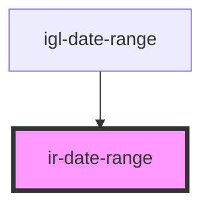

# ir-date-range


<!-- Auto Generated Below -->


## Properties

| Property           | Attribute            | Description                                                                         | Type                                                            | Default                                                                                                                      |
| ------------------ | -------------------- | ----------------------------------------------------------------------------------- | --------------------------------------------------------------- | ---------------------------------------------------------------------------------------------------------------------------- |
| `applyLabel`       | `apply-label`        | Text shown on the Apply button.                                                     | `string`                                                        | `'Apply'`                                                                                                                    |
| `autoApply`        | `auto-apply`         | Whether to apply the selected range automatically without clicking 'Apply'.         | `boolean`                                                       | `undefined`                                                                                                                  |
| `cancelLabel`      | `cancel-label`       | Text shown on the Cancel button.                                                    | `string`                                                        | `'Cancel'`                                                                                                                   |
| `customRangeLabel` | `custom-range-label` | Label used for the custom date range option.                                        | `string`                                                        | `'Custom'`                                                                                                                   |
| `date`             | --                   | Single date selection value (used in single date picker mode).                      | `Date`                                                          | `undefined`                                                                                                                  |
| `daysOfWeek`       | --                   | Abbreviated names of the days of the week.                                          | `string[]`                                                      | `['Su', 'Mo', 'Tu', 'We', 'Th', 'Fr', 'Sa']`                                                                                 |
| `disabled`         | `disabled`           | Disables the date range input when true.                                            | `boolean`                                                       | `false`                                                                                                                      |
| `firstDay`         | `first-day`          | First day of the week (0 = Sunday, 1 = Monday, ...).                                | `number`                                                        | `1`                                                                                                                          |
| `format`           | `format`             | Date format used in the input and picker.                                           | `string`                                                        | `'MMM DD, YYYY'`                                                                                                             |
| `fromDate`         | --                   | Start date for the date range.                                                      | `Date`                                                          | `undefined`                                                                                                                  |
| `fromLabel`        | `from-label`         | Label for the "From" date input.                                                    | `string`                                                        | `'Form'`                                                                                                                     |
| `maxDate`          | `max-date`           | Maximum selectable date.                                                            | `Date \| string`                                                | `undefined`                                                                                                                  |
| `maxSpan`          | `max-span`           | Maximum range span (e.g., `{ days: 240 }`).                                         | `Duration \| DurationInputObject \| FromTo \| number \| string` | `{ days: 240 }`                                                                                                              |
| `minDate`          | `min-date`           | Minimum selectable date.                                                            | `Date \| string`                                                | `undefined`                                                                                                                  |
| `monthNames`       | --                   | Month names shown in the calendar header.                                           | `string[]`                                                      | `['January', 'February', 'March', 'April', 'May', 'June', 'July', 'August', 'September', 'October', 'November', 'December']` |
| `opens`            | `opens`              | Defines which side the calendar opens to. Options: `'left'`, `'right'`, `'center'`. | `"center" \| "left" \| "right"`                                 | `undefined`                                                                                                                  |
| `separator`        | `separator`          | Separator string used between start and end dates.                                  | `string`                                                        | `' - '`                                                                                                                      |
| `singleDatePicker` | `single-date-picker` | Enables single date selection mode.                                                 | `boolean`                                                       | `false`                                                                                                                      |
| `toDate`           | --                   | End date for the date range.                                                        | `Date`                                                          | `undefined`                                                                                                                  |
| `toLabel`          | `to-label`           | Label for the "To" date input.                                                      | `string`                                                        | `'To'`                                                                                                                       |
| `weekLabel`        | `week-label`         | Label for the week column in the calendar.                                          | `string`                                                        | `'W'`                                                                                                                        |


## Events

| Event         | Description                                                                                                                  | Type                                           |
| ------------- | ---------------------------------------------------------------------------------------------------------------------------- | ---------------------------------------------- |
| `dateChanged` | Emits when a new date range is selected.  Example: ```tsx <ir-date-range onDateChanged={(e) => console.log(e.detail)} /> ``` | `CustomEvent<{ start: Moment; end: Moment; }>` |


## Methods

### `openDatePicker() => Promise<void>`

Opens the date picker programmatically.

Example:
```ts
const el = document.querySelector('ir-date-range');
await el.openDatePicker();
```

#### Returns

Type: `Promise<void>`


## Dependencies

### Used by

 - [igl-date-range](../../igloo-calendar/igl-date-range)

### Graph


----------------------------------------------

*Built with [StencilJS](https://stenciljs.com/)*
