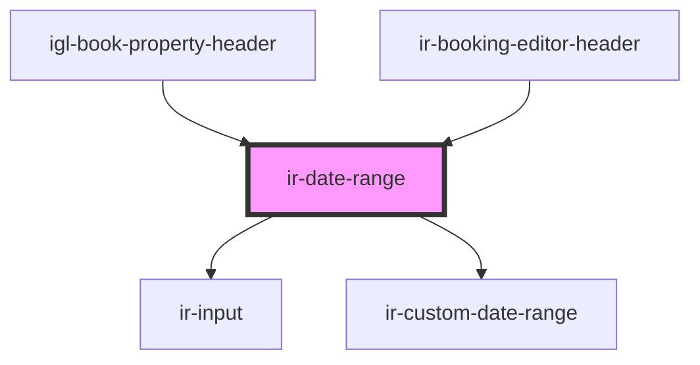

# igl-date-range

<!-- Auto Generated Below -->

## Properties

| Property             | Attribute              | Description                                                                                                                                     | Type                             | Default     |
| -------------------- | ---------------------- | ----------------------------------------------------------------------------------------------------------------------------------------------- | -------------------------------- | ----------- |
| `dateLabel`          | `date-label`           | Optional label text shown above the input (forwarded to ir-input).                                                                              | `string`                         | `undefined` |
| `defaultData`        | --                     | Initial date values. Expects `{ fromDate: string \| Date, toDate: string \| Date }`. Re-initializes dates whenever this prop reference changes. | `{ [key: string]: any; }`        | `undefined` |
| `disabled`           | `disabled`             | When `true`, the picker is disabled and cannot be opened.                                                                                       | `boolean`                        | `false`     |
| `hint`               | `hint`                 | Optional hint text rendered below the input.                                                                                                    | `string`                         | `undefined` |
| `maxDate`            | `max-date`             | ISO date string (YYYY-MM-DD) for the latest selectable date.                                                                                    | `string`                         | `undefined` |
| `minDate`            | `min-date`             | ISO date string (YYYY-MM-DD) for the earliest selectable date.                                                                                  | `string`                         | `undefined` |
| `size`               | `size`                 | Controls the visual size of the input trigger.                                                                                                  | `"large" \| "medium" \| "small"` | `'small'`   |
| `variant`            | `variant`              | `"booking"` shows the nights badge; `"default"` hides it.                                                                                       | `"booking" \| "default"`         | `'default'` |
| `withDateDifference` | `with-date-difference` | When `true` and `variant="booking"`, a nights badge is shown inside the input.                                                                  | `boolean`                        | `true`      |

## Events

| Event             | Description                                                                                                                                                | Type                                                  |
| ----------------- | ---------------------------------------------------------------------------------------------------------------------------------------------------------- | ----------------------------------------------------- |
| `dateRangeChange` | Emits the selected check-in / check-out as Moment objects.                                                                                                 | `CustomEvent<{ checkIn: Moment; checkOut: Moment; }>` |
| `dateRangeHide`   | Fired when the calendar popup closes.                                                                                                                      | `CustomEvent<void>`                                   |
| `dateRangeShow`   | Fired when the calendar popup opens.                                                                                                                       | `CustomEvent<void>`                                   |
| `dateSelectEvent` | **[DEPRECATED]** Prefer `dateRangeChange`.  Legacy event – emits `{ key, data }` for backward-compatible consumers. | `CustomEvent<{ [key: string]: any; }>`                |

## Methods

### `closeDatePicker() => Promise<void>`

Closes the calendar popup. Also invoked automatically on outside clicks via `@ClickOutside`.

#### Returns

Type: `Promise<void>`

### `openDatePicker() => Promise<void>`

Opens the calendar popup.

#### Returns

Type: `Promise<void>`

## Shadow Parts

| Part              | Description |
| ----------------- | ----------- |
| `"anchor"`        |             |
| `"body"`          |             |
| `"calendar"`      |             |
| `"calendar-icon"` |             |
| `"combobox"`      |             |
| `"input"`         |             |
| `"nights-badge"`  |             |
| `"popup"`         |             |

## Dependencies

### Used by

 - [igl-book-property-header](../../igloo-calendar/igl-book-property/igl-book-property-header)
 - [ir-booking-editor-header](../../igloo-calendar/ir-booking-editor/ir-booking-editor-header)

### Depends on

- [ir-input](../ir-input)
- [ir-custom-date-range](../ir-custom-date-range)

### Graph

```mermaid
graph TD;
  ir-date-range --> ir-input
  ir-date-range --> ir-custom-date-range
  igl-book-property-header --> ir-date-range
  ir-booking-editor-header --> ir-date-range
  style ir-date-range fill:#f9f,stroke:#333,stroke-width:4px
```

----------------------------------------------

*Built with [StencilJS](https://stenciljs.com/)*
