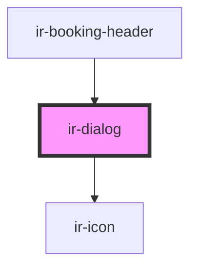

# ir-dialog


<!-- Auto Generated Below -->


## Properties

| Property | Attribute | Description                                                                                     | Type      | Default |
| -------- | --------- | ----------------------------------------------------------------------------------------------- | --------- | ------- |
| `open`   | `open`    | Controls whether the dialog should be opened. Can be updated externally and watched internally. | `boolean` | `false` |


## Events

| Event        | Description                                                                                                             | Type                   |
| ------------ | ----------------------------------------------------------------------------------------------------------------------- | ---------------------- |
| `openChange` | Emits the open/close state of the modal.  Example: ```tsx <ir-dialog onOpenChange={(e) => console.log(e.detail)} /> ``` | `CustomEvent<boolean>` |


## Methods

### `closeModal() => Promise<void>`

Closes the modal dialog programmatically.
Reverts body scroll and emits `openChange`.

#### Returns

Type: `Promise<void>`


### `openModal() => Promise<void>`

Opens the modal dialog programmatically.
Applies `overflow: hidden` to the `body`.

Example:
```ts
const dialog = document.querySelector('ir-dialog');
await dialog.openModal();
```

#### Returns

Type: `Promise<void>`


## Dependencies

### Used by

 - [ir-booking-header](../../ir-booking-details/ir-booking-header)

### Depends on

- [ir-icon](../ir-icon)

### Graph


----------------------------------------------

*Built with [StencilJS](https://stenciljs.com/)*
