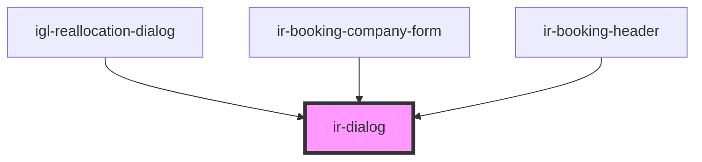

# ir-dialog

<!-- Auto Generated Below -->

## Properties

| Property        | Attribute        | Description                                                                                                                                                                                     | Type      | Default     |
| --------------- | ---------------- | ----------------------------------------------------------------------------------------------------------------------------------------------------------------------------------------------- | --------- | ----------- |
| `label`         | `label`          | The dialog's label as displayed in the header. You should always include a relevant label, as it is required for proper accessibility. If you need to display HTML, use the label slot instead. | `string`  | `undefined` |
| `lightDismiss`  | `light-dismiss`  | When enabled, the dialog will be closed when the user clicks outside of it.                                                                                                                     | `boolean` | `true`      |
| `open`          | `open`           | Indicates whether or not the dialog is open. Toggle this attribute to show and hide the dialog.                                                                                                 | `boolean` | `undefined` |
| `withoutHeader` | `without-header` | Disables the header. This will also remove the default close button.                                                                                                                            | `boolean` | `undefined` |

## Events

| Event               | Description                                                                                                                                                                                                                                                                                                                                                                                                                        | Type                                |
| ------------------- | ---------------------------------------------------------------------------------------------------------------------------------------------------------------------------------------------------------------------------------------------------------------------------------------------------------------------------------------------------------------------------------------------------------------------------------- | ----------------------------------- |
| `irDialogAfterHide` | Emitted after the dialog closes and all animations are complete.                                                                                                                                                                                                                                                                                                                                                                   | `CustomEvent<void>`                 |
| `irDialogAfterShow` | Emitted after the dialog opens and all animations are complete.                                                                                                                                                                                                                                                                                                                                                                    | `CustomEvent<void>`                 |
| `irDialogHide`      | Emitted when the dialog is requested to close. Calling event.preventDefault() will prevent the dialog from closing. You can inspect event.detail.source to see which element caused the dialog to close. If the source is the dialog element itself, the user has pressed Escape or the dialog has been closed programmatically. Avoid using this unless closing the dialog will result in destructive behavior such as data loss. | `CustomEvent<{ source: Element; }>` |
| `irDialogShow`      | Emitted when the dialog opens.                                                                                                                                                                                                                                                                                                                                                                                                     | `CustomEvent<void>`                 |

## Methods

### `closeModal() => Promise<void>`

#### Returns

Type: `Promise<void>`

### `openModal() => Promise<void>`

#### Returns

Type: `Promise<void>`

## Dependencies

### Used by

 - [igl-reallocation-dialog](../../igloo-calendar/igl-reallocation-dialog)
 - [ir-booking-company-form](../../ir-booking-details/ir-booking-company-form)
 - [ir-booking-header](../../ir-booking-details/ir-booking-header)

### Graph

----------------------------------------------

*Built with [StencilJS](https://stenciljs.com/)*
