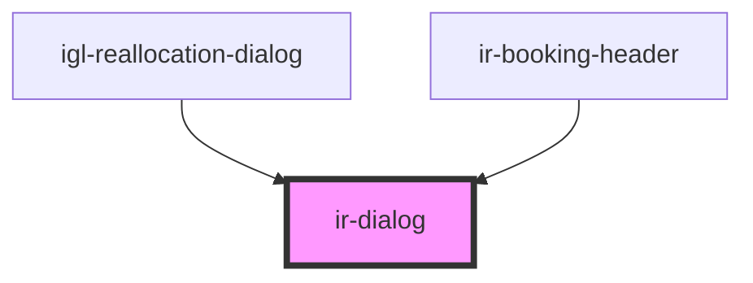

# ir-dialog

<!-- Auto Generated Below -->

## Properties

| Property | Attribute | Description                                                                        | Type      | Default |
| -------- | --------- | ---------------------------------------------------------------------------------- | --------- | ------- |
| `open`   | `open`    | Controls whether the dialog is open. Reflects to the host attribute for CSS hooks. | `boolean` | `false` |

## Events

| Event        | Description                                                                        | Type                   |
| ------------ | ---------------------------------------------------------------------------------- | ---------------------- |
| `openChange` | Emits when the open state changes due to user interaction or programmatic control. | `CustomEvent<boolean>` |

## Methods

### `closeModal() => Promise<void>`

Closes the dialog programmatically and restores focus to the previously active element.

#### Returns

Type: `Promise<void>`

### `openModal() => Promise<void>`

Opens the dialog programmatically using the native `showModal` API.

#### Returns

Type: `Promise<void>`

## Dependencies

### Used by

 - [igl-reallocation-dialog](../../igloo-calendar/igl-reallocation-dialog)
 - [ir-booking-header](../../ir-booking-details/ir-booking-header)

### Graph

----------------------------------------------

*Built with [StencilJS](https://stenciljs.com/)*
